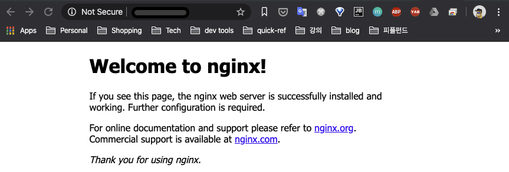
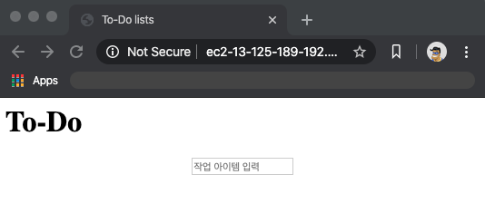
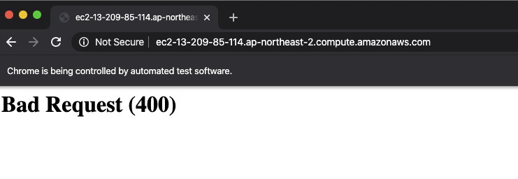

# 9장 운영 준비 배포 시작

> 여기서부터는 영문판 최신 버전을 기준으로 작성했습니다.
> 이유는 django 버전이 올라가고 리눅스 환경이 변해서 현재 버전이 더 적용하기 편하기 때문입니다.

## 우리가 해야 할 일 - 임시 방편 배포를 운영 준비 배포로 바꾸자

- 보통의 URL은 일반적으로 80 포트로 호스팅한다(현재는 8000포트).
- django dev server 는 보통 운영 환경해서는 사용하지 않는다.
  - 실제 운영 부하를 견디도록 설계 되지 않았다.
  - Nignx - Gunicorn 혹은 Python/WSGI server 조합을 많이 사용한다.
- `settings.py` 세틍이 운영환경에 맞게 되지 않았다.
  - `DEBUG=True` 같은 경우 운영환경에 피해야 한다.
  - `ALLOWED_HOSTS` 도 운영환경에 맞게 적용
  - `SECRET_KEY` - 유니크 키로 세팅
- 서버가 ssh 로 시작하도록 하지 않고, `systemd` 로 서버 재부팅에도 자동으로 시작하도록 설정되어야 한다

## Nginx로 전환

### 설치

다음과 같은 명령어로 설치한다.

```sh
webapp@server:$ sudo apt install nginx
webapp@server:$ sudo systemctl start nginx
```

사이트 IP 주소로 브라우저 접속해보면 "Welcome to nginx" 페이지를 볼 수 있다.



> 페이지가 계속 로딩중일 경우는 방화벽이 80포트(http) 막았기 때문일 것이다.
>
> 각 환경에 따라서 80포트를 풀어준다(AWS 경우는 EC2 Security Group 의 inbound 에 80 포트 등록)

### FT 는 실패하지만, nginx 는 실행 중 확인

포트 8000 번을 제외하고 FT를 실행하면, nginx 의 첫 화면을 언급하는 에러가 뜨면서 실패합니다.

```sh
$ STAGING_SERVER=staging.superlists.ml python manage.py test functional_tests
[...]
selenium.common.exceptions.NoSuchElementException: Message: Unable to locate
element: [id="id_new_item"]
[...]
AssertionError: 'To-Do' not found in 'Welcome to nginx!'
```

자 이제는 nignx가 django 가 연동되어 80번포트에 superlists 앱이 실행되도록 할 차례이다.

### 간단한 nginx 설정

스테이징 사이트에 대한 http 리퀘스트를 Django로 보내도록 알려주는 Nginx 설정 파일을 만든다. 최소 구성은 다음과 같다.

`server: /etc/nginx/sites-available/staging.superlists.ml`

```nginx
server {
    listen 80;
    server_name staging.superlists.ml;

    location / {
        proxy_pass http://localhost:8000;
    }
}
```

이 설정은 staging 도메인 만 수신하고,

모든 http 요청(80포트)을 localhost 8000 포트에 reverse proxy 한다.

즉  staging.superlists.ml 80포트 요청을 django 8000 포트가 응답을 받도록 한다.

이 파일이 nginx 설정에 적용되도록 하려면, `/etc/nginx/sites-available` 디렉토리에 `staging.superlists.ml` 파일로 저장한다.

이후 설정 활성화를 하려면 `/etc/nginx/sites-enabled/` 디렉토리에 해당 파일을 symlink로 연결한다.

```sh
# reset our env var (if necessary)
webapp@server:$ export SITENAME=staging.superlists.ml

webapp@server:$ cd /etc/nginx/sites-enabled/
webapp@server:$ sudo ln -s /etc/nginx/sites-available/$SITENAME $SITENAME

# check our symlink has worked:
webapp@server:$ readlink -f $SITENAME
/etc/nginx/sites-available/staging.superlists.ml
```

이것이 데비안/우분투에서 Nginx 구성을 저장하는 데 선호하는 방법이다.

즉, 실제 설정인 sites-available 과 symlink인 sites-enabled 로 별도 구성되어 있다.

장점은 개별 사이트를보다 쉽게 ​​켜거나 끌 수 있다는 것이다.


기본 설정의 혼동을 피하기 위해 "Welcome to Nginx" 설정을 지우는게 좋다.

```sh
webapp@server:$ sudo rm /etc/nginx/sites-enabled/default
```

마지막으로 설정을 테스트한 후, nginx 를 리로드하고, django를 리스타트 한다.

```sh
webapp@server:$ sudo systemctl reload nginx
webapp@server:$ cd ~/sites/$SITENAME
webapp@server:$ ./virtualenv/bin/python manage.py runserver 8000
```

FT를 80포트로 실행해보자.

```sh
$ STAGING_SERVER=staging.superlists.ml ./manage.py test functional_tests --failfast
[...]

...
 ---------------------------------------------------------------------
Ran 3 tests in 10.718s

OK
```

그린 상태로 다시 되돌아 왔다.

### Gunicorn 으로 전환

Gunicorn 설치부터 한다.

```sh
webapp@server:$ ./virtualenv/bin/pip install gunicorn
```

Gunicorn 실행하려면 wsgi 경로 위치를 알려줘야 한다. 장고는 이 실행 코드가 `superlists/wsgi.py` 에 위치한다.

```sh
webapp@server:~/sites/staging.superlists.ml$ ./virtualenv/bin/gunicorn superlists.wsgi:application
[2020-02-13 00:05:00 +0000] [2432] [INFO] Starting gunicorn 20.0.4
[2020-02-13 00:05:00 +0000] [2432] [INFO] Listening at: http://127.0.0.1:8000 (2432)
[2020-02-13 00:05:00 +0000] [2432] [INFO] Using worker: sync
[2020-02-13 00:05:00 +0000] [2435] [INFO] Booting worker with pid: 2435
```

자 다시 환경이 재구성 되었으니 FT 테스트를 해보자. 실패가 발생한다.

```sh
$ STAGING_SERVER=ec2-13-125-189-192.ap-northeast-2.compute.amazonaws.com python manage.py test functional_tests
$ STAGING_SERVER=staging.superlists.ml python manage.py test functional_tests
[...]
AssertionError: 117.0 != 512 within 10 delta
FAILED (failures=1)
```

브라우져로 띄워보면 화면이 깨져있다. CSS가 적용되어 있지 않다.

CSS가 깨진 이유는 Django dev 서버가 정적 파일을 알아서 제공하지만 Gunicorn은 그렇지 않기 때문이다.



### Nginx에서 정적 파일을 제공하기

문제를 발견했으니 한걸음 더 가보자.

먼저 장고 커맨드 `collectstatic` 로 정적 파일들을 nginx가 찾을 수 있는 경로로 복사한다.

```sh
webapp@server:$ ./virtualenv/bin/python manage.py collectstatic --noinput
[...]
15 static files copied to '/home/webapp/sites/staging.superlists.ml/static'
elspeth@server:$ ls static/
base.css  bootstrap
```

다음 Nginx에 설정에 두 번째 위치 directive를 추가하여 정적 파일 제공을 시작하도록 지시합니다.

```sh
server {
    listen 80;
    server_name superlists-staging.ottg.eu;

    location /static {
        alias /home/webapp/sites/staging.superlists.ml/static;
    }

    location / {
        proxy_pass http://localhost:8000;
    }
}
```

Nginx 와 Gunicorn 을 재시작합니다.

```sh
webapp@server:$ sudo systemctl reload nginx
webapp@server:$ ./virtualenv/bin/gunicorn superlists.wsgi:application
```

브라우저로 실행해보면 정상적으로 다시 화면이 보일 것이다. FT를 실행하여 검사해 보자.

```sh
$ STAGING_SERVER=staging.superlists.ml python manage.py test functional_tests
[...]

...
 ---------------------------------------------------------------------
Ran 3 tests in 10.718s

OK
```

### 유닉스 소켓 사용으로 전환

스테이징과 라이브 서버 둘다 8000번 포트를 사용할 수는 없다. 

서로 다른 포트를 할당할 수 는 있지만 서로 햇갈려서 잘못 사용할 가능성이 높다.

더 나은 방식은 유닉스 도메인 소켓을 사용하는 것이다.

디스크의 파일과 유사하나 Nginx 와 Gunicorn 이 서로 통신하는데 사용된다.

이 소켓을 `/tmp` 경로에 넣는걸로 하고 설정을 시작해 보자.

server: /etc/nginx/sites-available/staging.superlists.ml
```sh
server {
    listen 80;
    server_name staging.superlists.ml;

    location /static {
        alias /home/elspeth/sites/staging.superlists.ml/static;
    }

    location / {
        proxy_pass http://unix:/tmp/staging.superlists.ml.socket;
    }
}
```

Gunicorn을 8000번 포트 대신 socket으로 수신 대기하도록 재시작한다.


```sh
webapp@server:$ sudo systemctl reload nginx
webapp@server:$ ./virtualenv/bin/gunicorn --bind \
    unix:/tmp/staging.superlists.ml.socket superlists.wsgi:application
```

그리고 다시 기능테스트를 실행해 보자.
```sh
$ STAGING_SERVER=staging.superlists.ml python manage.py test functional_tests
[...]
OK
```

### 환경 변수를 사용하여 운영환경 설정 조정(예제 : [09-01](./09-01))

`settings.py` 에는 운영환경에 맞게 변경할 사항이 몇가지 있다.

- `ALLOWED_HOSTS`가 현재 `*`로 설정되어 안전하지 않다. 설정한 사이트 (staging.superlists.ml)에만 일치하도록 설정하도록 한다.
- `DEBUG` 모드는 자신의 서버에서 해킹하는 데 매우 적합하지만 해당 페이지를 추적 가능한 전체 페이지로 남겨 두는 것은 안전하지 않다.
- `SECRET_KEY`는 Django에서 쿠키 및 CSRF 보호와 같은 일부 암호화에 사용한다. 서버의 비밀 키가 소스 코드 리포지토리의 비밀 키와 다른지 확인하는 것이 좋다. 이 코드는 낯선 사람에게 보일 수 있기 때문이다. 새로운 무작위 파일을 생성하고 가까운 장래에 동일하게 유지하도록 한다. [장고 공식문서 보기](https://docs.djangoproject.com/en/2.2/topics/signing/#protecting-the-secret-key).

환경변수는 개발, 스테이징, 운영 서버의 다른 설정을 저장하기에 알맞다.

#### [superlists/settings.py](./09-01/superlists/superlists/settings.py)

```py
[...]
if 'DJANGO_DEBUG_FALSE' in os.environ:  
    DEBUG = False
    SECRET_KEY = os.environ['DJANGO_SECRET_KEY']  
    ALLOWED_HOSTS = [os.environ['SITENAME']]  
else:
    DEBUG = True  
    SECRET_KEY = 'insecure-key-for-dev'
    ALLOWED_HOSTS = []
[...]
```

- `DJANGO_DEBUG_FALSE` 는 장고의 디버그 모드를 끄는데 운영 환경에서는 꼭 설정해야 한다.
- `SECRET_KEY` 와 `ALLOWED_HOSTS` 는 디버그 모드를 끄면 반드시 설정해야 한다.
- 디버그 모드를 켜면 개발환경에 유용한 보안에 안전하지 않은 설정으로 된다.

위의 변경사항을 git 으로 반영하고 github에 push 한다.

```
$ git commit -am "use env vars for prod settings DEBUG, ALLOWED_HOSTS, SECRET_KEY"
$ git push
```

다시 서버에서 pull 명령으로 변경 사항을 가져온다.

```sh
webapp@server:$ git pull
webapp@server:$ export DJANGO_DEBUG_FALSE=y DJANGO_SECRET_KEY=abc123
# we'll set the secret to something more secure later!
webapp@server:$ ./virtualenv/bin/gunicorn --bind \
    unix:/tmp/staging.superlists.ml.socket superlists.wsgi:application

```

잘 되는지 FT를 실행해 보자.

```sh
$ STAGING_SERVER=staging.superlists.ml ./manage.py test functional_tests --failfast
[...]
AssertionError: 'To-Do' not found in ''
```

테스트를 해보면 400에러가 중간에 뜨면서 실패한다.



### 오류 메시지 필수검색

FT 를 변경때마다 자주 실행했기에 문제를 조기에 파악할 수 있었다.

지금 변경한 것은 `settings.py`의 세가지 세팅뿐이다. 따라서 이 중에 하나가 문제일 가능성이 높다.

`구글링으로 에러메시지 검색하기` 신공을 쓰자.(물론 아래의 책은 없다.)


[`django 400 bad request`](http://google.com/?q=django+400+bad+request) 로 구글링을 해 보면 400 에러의 원인은 `ALLOWED_HOSTS` 인 경우가 많다.

이전장에서는 장고의 디버그 모드여서 친절하게 원인을 알려주는 메시지가 같이 웹 사이트에 표시되었으나 운영환경에서 `DEBUG=False`로 했기 때문에 최소한의 400 에러 창 밖에 볼수가 없다.

`ALLOWED_HOSTS` 에 어떤 문제가 있는 것인가? 검색한 결과중 첫번째는 우리에게 문제의 단서를 제공해 준다. [이 문서 링크](https://www.digitalocean.com/community/questions/bad-request-400-django-nginx-gunicorn-on-debian-7)

