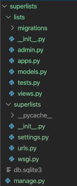

# 3장 단위 테스트를 이용한 간단한 홈페이지 테스트

## Intro

본격적인 To-Do 웹 에플리케이션 개발을 위해 단위 테스트를 만들어본다.

## 첫 Django 애플리케이션과 첫 단위 테스트

- Django 는 1개 프로젝트에 n개 app으록 구성되어 있다.
- 이것은 다른 프로젝트에서도 동일한 앱을 사용가능하도록 app 단위로 재사용을 가능하게 하기 위한 것이다.
- 앱은 코드를 구조화하기위한 좋은 수단이다.

### 작업 목록 앱을 만들어 보자.

```sh
$ python manage.py startapp lists

```

실행하면 superlists/superlists 와 동일 위치에 spuerlists/lists 라는 폴더가 생성된다.



## 단위 테스트는 무엇이고, 기능 테스트와 어떤 차이가 있을까?

| 종류| 단위 테스트 | 기능 테스트 |
| ------------- |:-------------:|:-----:|
| 관점 | 프로그래머 관점 | 사용자 관점 |
| 목표 | 애플리케이션 내부 | 애플리케이션 외부 |
| 레이어 | 하위 레벨 | 상위 레벨 |

### 테스트 작업 순서

1. 기능 테스트 작성 : 사용자 관점의 새로운 기능성 정의
2. 기능 테스트 실패 - 하위단의 어떤 기능을 작성해야 통과할지 고민/설계
  2-1. 단위 테스트 작성 : 기능테스트에서의 고민은 테스트로 작성
  2-2. 단위 테스트 실패 : 테스트를 통과할 정도로 최소한의 코드 작성. 과정 2-1/2-2를 하나의 기능 테스트 완성될 때까지 반복
3. 기능 테스트 재실행하여 통과하는지 확인. 실패시 과정 2로 돌아가서 다시 작성. 통과시 한가지 기능 완성

즉 상위단(기능테스트) 를 먼저 작성후에 그 하위단(단위 테스트)을 잘게 쪼게서 테스트 함을 알수 있다.
번거로워 보일 수 있으나, 실질적인 설계와 이후에 검증할수 있는 자동화된 툴까지 만들어지기 때문에 합리적인 프로세스인거 같다.

## Django에서의 단위 테스트

### TDD 주기

선 실패 -> 테스트를 통과할 코드 작성 -> 후 통과 -> 새 테스트 코드 작성 -> 선 실패..(계속 반복)

### django.test.TestCase

Django는 기본 TestCase class를 확장한 django.test.TestCase 클래스를 기본 단위 테스트로 사용하도록 권하고 있다.
django 프로젝트에 맞는 여러 확장 기능들이 있다.
그 중에 manage.py 에서 test 커맨드로 전체 testcase를 실행하는 기능이 포함되어 있다.
고의적인 실패 테스트를 작성하여 이를 확인해 보자.

[lists/tests.py](./03-02/superlist/../superlists/lists/tests.py)

```sh
$ python manage.py test

Creating test database for alias 'default'...
System check identified no issues (0 silenced).
F
======================================================================
FAIL: test_bad_maths (lists.tests.SmokeTest)
----------------------------------------------------------------------
Traceback (most recent call last):
  File "workspace/superlists/lists/tests.py", line 7, in test_bad_maths
    self.assertEqual(1 + 1, 3)
AssertionError: 2 != 3

----------------------------------------------------------------------
Ran 1 test in 0.001s

FAILED (failures=1)
Destroying test database for alias 'default'...
```
