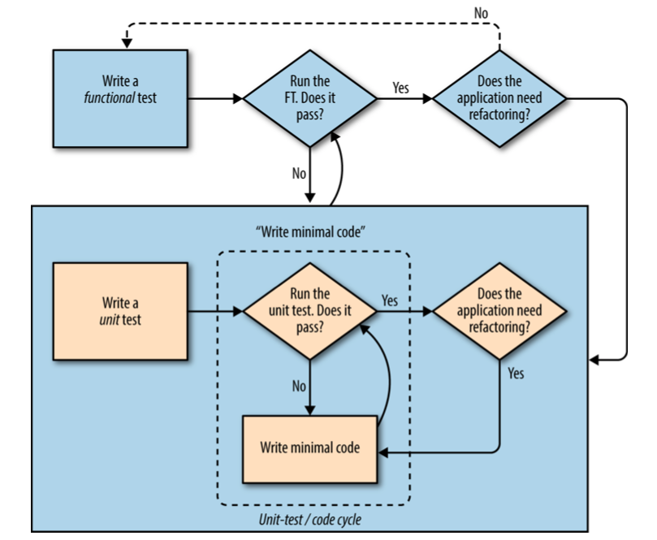

# 4장 왜 테스트를 하는 것인가(그리고 리펙토링)?

## 프로그래밍은 우물에서 물을 퍼 올리는 것과 같다

- 켄트 벡(Kent Back, TDD) says
  - 우물가에 있는 물 뜨는 두레박 비유
  - 처음 몇번은 두레박으로 물을 퍼올리는건 쉬움
  - 시간이 지나면서 곧 지치기 시작함
  - **도르레** 를 이용하면 직접 퍼올리는 것보도 효율적
- TDD는 **도르레** 와 같이 작업 효율을 올려줌, 작업이 뒤로 미끄러져 가는것도 막아줌
- TDD는 **훈련** 이다. 자연스럽게 익혀지는 것이 아니다. 성과가 즉시 나는 것이 아닌 오랜 기간을 거쳐야 한다.
- 필자가 보여주고자 하는 것은 철저한 TDD. 무술의 카타[kata](https://en.wikipedia.org/wiki/Kata)와 같음
- 결론은 개발 내공증진에 분명 도움되니 무술처럼 연습해서 익혀라!

## 셀레늄을 이용한 사용자 반응 테스트(예제 : [04-01](04-01))

이전 장 마지막에 이어서 작업한다.

바로 아래 주석 처리되어 있는 내용의 테스트 코드를 작성한다.

```py
        # 그녀는 바로 작업을 추가하기로 한다.

        # "공작깃털 사기" 라고 텍스트 상자에 입력한다.
        # (에디스의 취미는 날치 잡이용 그물을 만드는 것이다)

        # 엔터키를 치면 페이지가 갱신되고 작업 목록에
        # "1: 공작깃털 사기" 아이템이 추가된다
```

[functional_test.py - 추가 작성한 테스트 코드](04-01/functional_test.py)

- 셀레늄 메소드 설명
  - find_element(s)_by_id - tag id로 요소를 찾음. 's'는 복수개의 요소를 list로 반환
  - find_element_by_tag_name - tag 이름으로 요소를 찾음. 's'는 복수개의 요소를 list로 반환
  - send_keys : 입력 요소를 타이핑함.

작성한 FT를 실행해보면 의도된 실패가 발생한다.

```sh
$ python functional_test.py

======================================================================
ERROR: test_can_start_a_list_and_retrieve_it_later (__main__.NewVisitorTest)
----------------------------------------------------------------------
Traceback (most recent call last):
  File "functional_test.py", line 21, in test_can_start_a_list_and_retrieve_it_later
    header_text = self.browser.find_element_by_tag_name('h1').text
  File "/tdd-with-python-env/lib/python3.7/site-packages/selenium/webdriver/remote/webdriver.py", line 530, in find_element_by_tag_name
    return self.find_element(by=By.TAG_NAME, value=name)
  File "/tdd-with-python-env/lib/python3.7/site-packages/selenium/webdriver/remote/webdriver.py", line 978, in find_element
    'value': value})['value']
  File "/tdd-with-python-env/lib/python3.7/site-packages/selenium/webdriver/remote/webdriver.py", line 321, in execute
    self.error_handler.check_response(response)
  File "/tdd-with-python-env/lib/python3.7/site-packages/selenium/webdriver/remote/errorhandler.py", line 242, in check_response
    raise exception_class(message, screen, stacktrace)
selenium.common.exceptions.NoSuchElementException: Message: no such element: Unable to locate element: {"method":"css selector","selector":"h1"}
  (Session info: chrome=78.0.3904.108)

----------------------------------------------------------------------
Ran 1 test in 7.356s

FAILED (errors=1)
```

## "상수는 테스트하지 마라"는 규칙과 탈출구로 사용할 템플릿 (예제 : [04-02](04-02))

### 단위 테스트 시의 규칙 : **상수는 테스트하지 마라**

아래의 코드를

```py
wibble = 3
```

아래 테스트로 굳이 만들 필요는 없다.

```py
from myprogram import wibble
assert wibble == 3
```

단위 테스트는 로직이나 흐름제어, 설정 등을 테스트하기 위한 것이다. 현재 테스트로 구현된 HTML 테스트는 문자열 비교를 하고 있는데 이것은 상수 테스트와 유사하다.

### 템플릿을 사용하기 위한 리펙터링

#### 리펙터링이란?

- **기능(결과물)은 바꾸지 않고** 코드 자체를 개선하는 작업
- **기능(결과물)은 바꾸지 않고** 가 핵심이다. 즉 기능 변경, 추가와 병행하면 안된다는 뜻이다. 반드시 문제가 발생한다.

지금부터 할 일은 HTML을 상수 문자열로 응답하고 테스트 했던 것을 Django 템플릿 기능으로 리펙터링 하는 과정이다.

1. 먼저 단위 테스트를 실행하여 통과하는지 확인한다. 통과가 되어야 이 결과 기준으로 리펙토링을 시작할 수 있다.

```sh
$ python manage.py test

Creating test database for alias 'default'...
System check identified no issues (0 silenced).
..
----------------------------------------------------------------------
Ran 2 tests in 0.020s

OK
Destroying test database for alias 'default'...
```

2. HTML 문자열을 별도의 파일(템플릿 파일)에 저장
  
[lists/templates/home.html](04-02/superlists/lists/templates/home.html)

3. 뷰 함수를 새로 만든 템플릿 파일에 지정함

[lists/views.py](04-02/superlists/lists/views.py)

4. 테스트 동작 여부 확인

```sh
$ python manage.py test

Creating test database for alias 'default'...
System check identified no issues (0 silenced).
E.
======================================================================
ERROR: test_home_page_returns_correct_html (lists.tests.HomePageTest)
----------------------------------------------------------------------
Traceback (most recent call last):
  File "/superlists/lists/tests.py", line 15, in test_home_page_returns_correct_html
    response = home_page(request)
  File "/superlists/lists/views.py", line 6, in home_page
    return render(request, 'home.html')
  File "/Users/pilhwankim/.pyenv/versions/tdd-with-python-env/lib/python3.7/site-packages/django/shortcuts.py", line 36, in render
    content = loader.render_to_string(template_name, context, request, using=using)
  File "/Users/pilhwankim/.pyenv/versions/tdd-with-python-env/lib/python3.7/site-packages/django/template/loader.py", line 61, in render_to_string
    template = get_template(template_name, using=using)
  File "/Users/pilhwankim/.pyenv/versions/tdd-with-python-env/lib/python3.7/site-packages/django/template/loader.py", line 19, in get_template
    raise TemplateDoesNotExist(template_name, chain=chain)
django.template.exceptions.TemplateDoesNotExist: home.html

----------------------------------------------------------------------
Ran 2 tests in 0.011s

FAILED (errors=1)
Destroying test database for alias 'default'...
```

왜 통과되지 않는지 확인해 보자면

- test_home_page_returns_correct_html 테스트가 ERROR 가 난다.
- TemplateDoesNotExist 인 것을 보면 템플릿을 찾을 수 없다고 한다.
- lists/views.py 6번째 라인에 문제가 있다. 찾아보면 render 함수 호출 부분이다.

문제의 원인은 Django 내 settings.py 의 INSTALLED_APPS 에 lists 앱을 사용한다는 등록이 되지 않았기 때문이다. 자세한 내용은(https://docs.djangoproject.com/en/2.2/ref/settings/#installed-apps)에 언급되어 있다.

5. INSTALLED_APPS 항목 추가

[superlists/settings.py](04-02/superlists/superlists/settings.py)

```py
# Application definition

INSTALLED_APPS = [
    'django.contrib.admin',
    'django.contrib.auth',
    'django.contrib.contenttypes',
    'django.contrib.sessions',
    'django.contrib.messages',
    'django.contrib.staticfiles',
    'lists', # 추가
]
```

6. 단위 테스트 재 확인

```sh
$ python manage.py test

Creating test database for alias 'default'...
System check identified no issues (0 silenced).
..
----------------------------------------------------------------------
Ran 2 tests in 0.035s

OK
```

코드 리펙토링 과정을 마쳤다. 한 가지가 남았다. 테스트 코드가 아직 HTML 문자열 상수로 남아있는데 이것도 고쳐주는 것이 좋다.

[lists/tests.py](04-02/superlists/lists/tests.py)

```py
(...생략...)

from django.template.loader import render_to_string

(...생략...)

    def test_home_page_returns_correct_html(self):
        request = HttpRequest()
        response = home_page(request)
        expected_html = render_to_string('home.html')
        self.assertEqual(response.content.decode(), expected_html)
```

response.content.decode() 의 decode() 함수는 response.content 바이트 데이터를 유니코드 문자열로 변환한다.

이것으로 바이트와 바이트를 비교 했던 것들을 문자열과 문자열로 비교하는 것으로 테스트가 바뀌었다.

### 리펙터링에 관하여

- **중요!** - 리펙터링 시에는 앱 코드와 테스트 코드를 한 번에 수정하는 것이 아니라 하나씩 수정해야 한다.
- 보통은 간단한 변경이라고 생각해서 단계를 건너뛰는 경우가 많다. 그게 쌓이다 보면 꼬이게 되고 돌아돌아 작업해야 하는 경우가 발생한다.


## 메인 페이지 추가 수정 (예제 : [04-03](04-03))

**Reminder** - 4장 처음에 추가했던 기능 테스트가 아직은 실패하고 있는 상태

다시 기능 테스트를 돌려 보면 추가가 필요한게 있다. home.html의 `<h1>` 이다.

[lists/templates/home.html](04-03/superlists/lists/templates/home.html)

추가후에 기능 테스트를 다시 돌리면

```sh
$ python functional_test.py
E
======================================================================
ERROR: test_can_start_a_list_and_retrieve_it_later (__main__.NewVisitorTest)
----------------------------------------------------------------------
Traceback (most recent call last):
  File "functional_test.py", line 25, in test_can_start_a_list_and_retrieve_it_later
    inputbox = self.browser.find_element_by_id('id_new_item')
  File "/Users/pilhwankim/.pyenv/versions/tdd-with-python-env/lib/python3.7/site-packages/selenium/webdriver/remote/webdriver.py", line 360, in find_element_by_id
    return self.find_element(by=By.ID, value=id_)
  File "/Users/pilhwankim/.pyenv/versions/tdd-with-python-env/lib/python3.7/site-packages/selenium/webdriver/remote/webdriver.py", line 978, in find_element
    'value': value})['value']
  File "/Users/pilhwankim/.pyenv/versions/tdd-with-python-env/lib/python3.7/site-packages/selenium/webdriver/remote/webdriver.py", line 321, in execute
    self.error_handler.check_response(response)
  File "/Users/pilhwankim/.pyenv/versions/tdd-with-python-env/lib/python3.7/site-packages/selenium/webdriver/remote/errorhandler.py", line 242, in check_response
    raise exception_class(message, screen, stacktrace)
selenium.common.exceptions.NoSuchElementException: Message: no such element: Unable to locate element: {"method":"css selector","selector":"[id="id_new_item"]"}
  (Session info: chrome=78.0.3904.108)


----------------------------------------------------------------------
Ran 1 test in 5.369s

FAILED (errors=1)
```

id 가 "id_new_item" 이라는 HTML 엘리먼트가 없다는 실패 결과를 내어준다.

이제 아래의 테스트 코드 주석을 만족시킬 구현 코드르 작성해야 한다.
```py
        # 그녀는 바로 작업을 추가하기로 한다.
        inputbox = self.browser.find_element_by_id('id_new_item')
        self.assertEqual(
            inputbox.get_attribute('placeholder'), 
            '작업 아이템 입력'
            )    

        # "공작깃털 사기" 라고 텍스트 상자에 입력한다.
        # (에디스의 취미는 날치 잡이용 그물을 만드는 것이다)
        inputbox.send_keys('공작깃털 사기')
```


[lists/templates/home.html](04-03/superlists/lists/templates/home.html)

다시 기능 테스트를 실행해보자.

```sh
$ python functional_test.py
E
======================================================================
ERROR: test_can_start_a_list_and_retrieve_it_later (__main__.NewVisitorTest)
----------------------------------------------------------------------
Traceback (most recent call last):
  File "functional_test.py", line 39, in test_can_start_a_list_and_retrieve_it_later
    table = self.browser.find_element_by_id('id_list_table')
  File "/Users/pilhwankim/.pyenv/versions/tdd-with-python-env/lib/python3.7/site-packages/selenium/webdriver/remote/webdriver.py", line 360, in find_element_by_id
    return self.find_element(by=By.ID, value=id_)
  File "/Users/pilhwankim/.pyenv/versions/tdd-with-python-env/lib/python3.7/site-packages/selenium/webdriver/remote/webdriver.py", line 978, in find_element
    'value': value})['value']
  File "/Users/pilhwankim/.pyenv/versions/tdd-with-python-env/lib/python3.7/site-packages/selenium/webdriver/remote/webdriver.py", line 321, in execute
    self.error_handler.check_response(response)
  File "/Users/pilhwankim/.pyenv/versions/tdd-with-python-env/lib/python3.7/site-packages/selenium/webdriver/remote/errorhandler.py", line 242, in check_response
    raise exception_class(message, screen, stacktrace)
selenium.common.exceptions.NoSuchElementException: Message: no such element: Unable to locate element: {"method":"css selector","selector":"[id="id_list_table"]"}
  (Session info: chrome=78.0.3904.108)


----------------------------------------------------------------------
Ran 1 test in 5.612s

FAILED (errors=1)
```

이번에는 id가 "id_list_table" 인 엘리먼트가 없다는 실패가 뜬다.

이제 아래의 테스트 코드 주석을 만족시킬 구현 코드르 작성해야 한다.

```py
        # 엔터키를 치면 페이지가 갱신되고 작업 목록에
        # "1: 공작깃털 사기" 아이템이 추가된다
        inputbox.send_keys(Keys.ENTER)

        table = self.browser.find_element_by_id('id_list_table')
        rows = table.find_elements_by_tag_name('tr')
        self.assertTrue(any(row.text == '1: 공작깃털 사기' for row in rows))
```

또 다시 기능 테스트를 실행해보자.

```sh
$ python functional_test.py
F
======================================================================
FAIL: test_can_start_a_list_and_retrieve_it_later (__main__.NewVisitorTest)
----------------------------------------------------------------------
Traceback (most recent call last):
  File "functional_test.py", line 41, in test_can_start_a_list_and_retrieve_it_later
    self.assertTrue(any(row.text == '1: 공작깃털 사기' for row in rows))
AssertionError: False is not true

----------------------------------------------------------------------
Ran 1 test in 4.534s

FAILED (failures=1)
```

실패 원인이 분명치 않은데 "functional_test.py", line 41 을 따라가 보면 기능 테스트 함수에 자세한 실패 메시지가 필요하다.

[functional_test.py - 추가 작성한 메시지](04-03/functional_test.py)

```sh
python functional_test.py
F
======================================================================
FAIL: test_can_start_a_list_and_retrieve_it_later (__main__.NewVisitorTest)
----------------------------------------------------------------------
Traceback (most recent call last):
  File "functional_test.py", line 44, in test_can_start_a_list_and_retrieve_it_later
    '신규 작업이 테이블에 표시되지 않는다'
AssertionError: False is not true : 신규 작업이 테이블에 표시되지 않는다

----------------------------------------------------------------------
Ran 1 test in 5.785s

FAILED (failures=1)
```

이제 실패 메시지가 명확하게 표시된다. 남은 기능 테스트의 문제의 해결은 5장에서 다룬다.

## 정리 : TDD 프로세스

### 전체 TDD 프로세스


2장부터 4장까지 죽 위와 같은 흐름으로 해왔다.

어떤 테스트라도 저 프로세스에 맞게 작성하였고 1번 테스트에 1번씩 저 프로세스를 돌게 했었다.

### Double-Loop TDD



이 흐름도는 단위 테스트와 기능 테스트가 같이 존재할 때 어떻게 TDD를 진행하는지 나타나는 예시다.

마치 이중 for 문을 돌 때처럼

- inner for 문을 단위 테스트 프로세스
- outer for 문을 기능 테스트 프로세스

로 이해하면 편할 듯 하다.

즉 1개의 기능 테스트에 n개의 단위 테스트가 존재하며,

- 1개의 기능 테스트 작성 후 실패
- 해당 기능테스트에 속한 단위 테스트를 하나하나 프로세스를 거침
- 1개 기능 테스트 성공

의 flow 를 거친다고 이해하면 편할 듯 하다.

그 동안 기능 테스트와 단위 테스트를 실제로 어떻게 적용하는지 감이 없었는데 이렇게 예제로 접하니깐 뭔가 적용할 만한거 같다.
