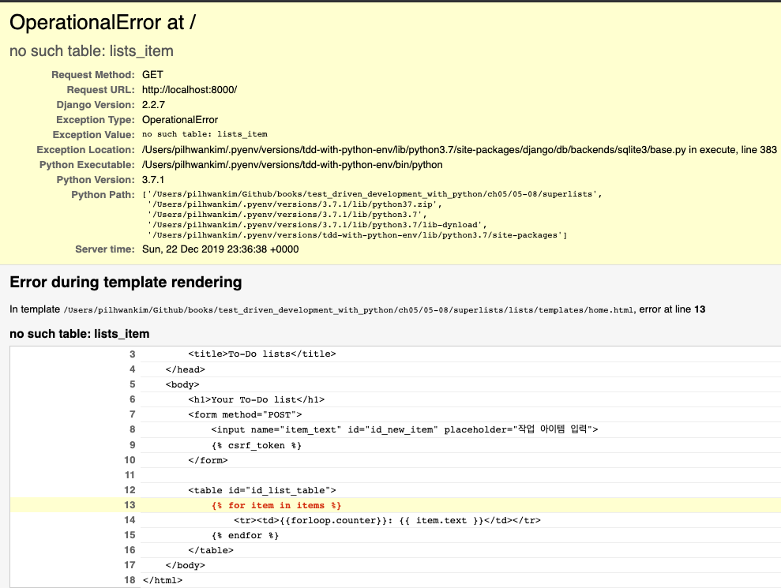

# 5장 사용자 입력 저장하기

## Intro

다시 한번 강조! TDD의 핵심은 **한 번에 한가지만 하는 것**

기능 테스트에 최소한의 기능만 구현

이번장에서 보여줄 것은?

- 사용자가 입력한 작업 아이템을 서버로 보내고 이를 저장한 후 다시 사용자에게 보여주는 시스템
- TDD 가 어떻게 반복적인 개발 스타일을 지원하는지 => 가장 빠른 방법은 아니나 결과적으로 개발 속도를 높여줌.
- 장고 모델, POST 요청처리, 장고 템플릿 테그 같은새로운 개념 소개

## POST 요청을 전송하기 위한 폼(Form) 연동(예제 : [05-01](./05-01))

4장 마지막에서 하지못했던 사용자 입력 기능을 구현해보도록 한다. 

바로 아래 기능 테스트 부분이다.

```py
        # 그녀는 바로 작업을 추가하기로 한다.
        inputbox = self.browser.find_element_by_id('id_new_item')
        self.assertEqual(
            inputbox.get_attribute('placeholder'),
            '작업 아이템 입력'
            )

        # "공작깃털 사기" 라고 텍스트 상자에 입력한다.
        # (에디스의 취미는 날치 잡이용 그물을 만드는 것이다)
        inputbox.send_keys('공작깃털 사기')

        # 엔터키를 치면 페이지가 갱신되고 작업 목록에
        # "1: 공작깃털 사기" 아이템이 추가된다
        inputbox.send_keys(Keys.ENTER)

        table = self.browser.find_element_by_id('id_list_table')
        rows = table.find_elements_by_tag_name('tr')
        self.assertTrue(
            any(row.text == '1: 공작깃털 사기' for row in rows),
            '신규 작업이 테이블에 표시되지 않는다'
            )
```

브라우저가 POST 요청을 보내기 위해서는

  - `<input>` 속성에 name= 속성을 지정
  - `<form>` 테그로 감싸야 함
  - `<form>` 테그에 method="POST" 지정해서 전송 방식 설정

이 내용을 반영한 내용이 아래에 링크되어 있다.

[lists/templates/home.html](05-01/superlists/lists/templates/home.html)

이제 반영이 되었으니 기능 테스트를 돌려본다.

```sh
$ python functional_test.py
E
======================================================================
ERROR: test_can_start_a_list_and_retrieve_it_later (__main__.NewVisitorTest)
----------------------------------------------------------------------
Traceback (most recent call last):
  File "functional_test.py", line 39, in test_can_start_a_list_and_retrieve_it_later
    table = self.browser.find_element_by_id('id_list_table')
  File "/Users/pilhwankim/.pyenv/versions/tdd-with-python-env/lib/python3.7/site-packages/selenium/webdriver/remote/webdriver.py", line 360, in find_element_by_id
    return self.find_element(by=By.ID, value=id_)
  File "/Users/pilhwankim/.pyenv/versions/tdd-with-python-env/lib/python3.7/site-packages/selenium/webdriver/remote/webdriver.py", line 978, in find_element
    'value': value})['value']
  File "/Users/pilhwankim/.pyenv/versions/tdd-with-python-env/lib/python3.7/site-packages/selenium/webdriver/remote/webdriver.py", line 321, in execute
    self.error_handler.check_response(response)
  File "/Users/pilhwankim/.pyenv/versions/tdd-with-python-env/lib/python3.7/site-packages/selenium/webdriver/remote/errorhandler.py", line 242, in check_response
    raise exception_class(message, screen, stacktrace)
selenium.common.exceptions.NoSuchElementException: Message: no such element: Unable to locate element: {"method":"css selector","selector":"[id="id_list_table"]"}
  (Session info: chrome=78.0.3904.108)

----------------------------------------------------------------------
Ran 1 test in 7.253s

FAILED (errors=1)
```

이전에 보지 못했던 몇가지 특이한 에러(그리고 현상)들이 나온다.

이 에러들을 파악해보려면 몇가지 디버깅 방법이 있다.

- print 문을 이용해 현재 페이지 텍스트 확인하기
- 에러 메시지를 개선해서 더 자세한 정보를 출력하기
- 수동으로 사이트를 열어보기
- time.sleep을 이용해 실행중에 있는 테스트를 잠시 정지시키기

여기서 마지막 sleep을 사용해보도록 한다.

[functional_test.py - sleep 추가](./05-01/functional_test.py)

기능 테스트를 다시 실행하면 브라우저가 10초 정도 멈추게 되는데 다음과 같은 화면이 나온다.


장고는 CSRF 보호를 기본으로 지원한다. CSRF에 대해서는 [CSRF 란?](https://ko.wikipedia.org/wiki/%EC%82%AC%EC%9D%B4%ED%8A%B8_%EA%B0%84_%EC%9A%94%EC%B2%AD_%EC%9C%84%EC%A1%B0) 을 참고하자.

CSRF 보호를 위해 장고는 각 폼이 생성하는 POST 요청에 토큰을 부여한다.

현재 방금 form에 그 처리가 되어 있지 않아 이 에러가 `CSRF validation fail` 이 발생한 것이다.

장고는 이 기능도 간편하게 제공한다. CSRF 전용 **템플릿 테그**를 추가한다.

[lists/templates/home.html](./05-01/superlists/lists/templates/home.html)

장고 내부에서는 이 테그를 CSRF 토근을 포함하는 `<input type="hidden">` 요소로 변경해서 랜더링한다.

다시 기능 테스트를 돌려보면 브라우저의 CSRF 에러는 나오지 않는다.

하지만 테스트 결과는 Fail 이 된다.

```sh
$ python functional_test.py
F
======================================================================
FAIL: test_can_start_a_list_and_retrieve_it_later (__main__.NewVisitorTest)
----------------------------------------------------------------------
Traceback (most recent call last):
  File "functional_test.py", line 47, in test_can_start_a_list_and_retrieve_it_later
    '신규 작업이 테이블에 표시되지 않는다'
AssertionError: False is not true : 신규 작업이 테이블에 표시되지 않는다

----------------------------------------------------------------------
Ran 1 test in 16.030s

FAILED (failures=1)
```

이제 브라우저 동작을 확인했으니 time.sleep은 필요없으므로 제거하자.

## 서버에서 POST 요청 처리(예제 : [05-02](./05-02))

폼에 action= 속성 내용이 없는 상태에서 submit 을 하면?

method=POST 가 지정되어 있으므로 현재 동일 URL에 POST 방식으로 요청함

이것을 검증할 단위 테스트가 필요하다.

[lists/tests.py](./05-02/superlists/lists/tests.py) - 단위 테스트 추가

HttpRequest 내 속성 정리

- .method : HTTP 요청 메서드(string 타입)
- .POST : POST 메서드인 요청 http body 내용(dict 타입)

새로 단위 테스트를 추가했으므로 의도적인 실패가 일어나는지 확인하자

```sh
python manage.py test
Creating test database for alias 'default'...
System check identified no issues (0 silenced).
FF.
======================================================================
FAIL: test_home_page_can_save_a_POST_request (lists.tests.HomePageTest)
----------------------------------------------------------------------
Traceback (most recent call last):
  File "/Users/pilhwankim/Github/books/test_driven_development_with_python/ch05/05-02/superlists/lists/tests.py", line 28, in test_home_page_can_save_a_POST_request
    self.assertIn('신규 작업 아이템', response.content.decode())
AssertionError: '신규 작업 아이템' not found in '<html>\n    <head>\n        <title>To-Do lists</title>\n    </head>\n    <body>\n        <h1>Your To-Do list</h1>\n        <form method="POST">\n            <input name="item_text" id="id_new_item" placeholder="작업 아이템 입력">\n            <input type="hidden" name="csrfmiddlewaretoken" value="67JC67qNcs6bsJlmhjMGrbMSvevTJ7qYVFfbZlGQ9WPLwK82e9r0jFfpSD9XJAUt">\n        </form>\n\n        <table id="id_list_table">\n        </table>\n    </body>\n</html>'

======================================================================
FAIL: test_home_page_returns_correct_html (lists.tests.HomePageTest)
----------------------------------------------------------------------
Traceback (most recent call last):
  File "/Users/pilhwankim/Github/books/test_driven_development_with_python/ch05/05-02/superlists/lists/tests.py", line 18, in test_home_page_returns_correct_html
    self.assertEqual(response.content.decode(), expected_html)
AssertionError: '<htm[227 chars]     <input type="hidden" name="csrfmiddleware[171 chars]tml>' != '<htm[227 chars]     \n        </form>\n\n        <table id="i[50 chars]tml>'

----------------------------------------------------------------------
Ran 3 tests in 0.006s

FAILED (failures=2)
Destroying test database for alias 'default'...
```

예상치 못한 상황이 발생했다. 보면 3개중 2개의 단위 테스트가 에러가 난다.

테스트 로그를 확인해보면 원인은 5장 맨처음 csrf tag를 넣음으로 템플릿 html 문자열과 응답 문자열(csrf input 이 포함된) 결과가 차이가 나서 생기는 실패이다.

이 차이는 어떻게 극복해야 하나?

스텍오버플로우에 관련 질문을 찾아보니 우회하는 방법이 있었다.

https://stackoverflow.com/questions/34629261/django-render-to-string-ignores-csrf-token/39859042#39859042

요약하면 `csrfmiddlewaretoken` 히든 필드를 테스트 코드에서 파이썬 정규표현식으로 제거하는 함수를 만드는 것이다.

```py
def remove_csrf(html_code):
    csrf_regex = r'&lt;input[^&gt;]+csrfmiddlewaretoken[^&gt;]+&gt;'
    return re.sub(csrf_regex, '', html_code)
```

lists/tests.py remove_csrf 함수를 다음과 같이 추가한다.

```py
    def test_home_page_returns_correct_html(self):
        #...생략...
        expected_html = render_to_string('home.html', request=request)
        self.assertEqual(remove_csrf(response.content.decode()), remove_csrf(expected_html))
```

테스트를 다시 돌려보면

```sh
$ python manage.py test
Creating test database for alias 'default'...
System check identified no issues (0 silenced).
F..
======================================================================
FAIL: test_home_page_can_save_a_POST_request (lists.tests.HomePageTest)
----------------------------------------------------------------------
Traceback (most recent call last):
  File "/Users/pilhwankim/Github/books/test_driven_development_with_python/ch05/05-02/superlists/lists/tests.py", line 36, in test_home_page_can_save_a_POST_request
    self.assertIn('신규 작업 아이템', response.content.decode())
AssertionError: '신규 작업 아이템' not found in '<html>\n    <head>\n        <title>To-Do lists</title>\n    </head>\n    <body>\n        <h1>Your To-Do list</h1>\n        <form method="POST">\n            <input name="item_text" id="id_new_item" placeholder="작업 아이템 입력">\n            <input type="hidden" name="csrfmiddlewaretoken" value="FO3gHv4cwdk1hJyTEmkpr5e3KGenddLiKNXz7K31FIcgFDOUi5tL47OXeohJW0Xs">\n        </form>\n\n        <table id="id_list_table">\n        </table>\n    </body>\n</html>'

----------------------------------------------------------------------
Ran 3 tests in 0.006s

FAILED (failures=1)
Destroying test database for alias 'default'..
```

이제 1가지 테스트 실패만 남았는데 이번에 추가한 테스트 코드이다.

이 것을 해결하려면 POST 요청을 처리하는 코드를 작성해야 한다.

제일 간단한 방식으로 반환값을 이용해서 해결해보자.

[lists/views.py](./05-02/superlists/lists/views.py)

```py
def home_page(request):
      return HttpResponse(request.POST['item_text'])
```

테스트는 모두 통과한다. 그러나 우리가 최종 원하는 결과는 아니다.

우리가 원하는 결과는 템플릿에 있는 새 TODO 리스트에 '신규 작업 아이템' 이 추가되는 것이다.

## 파이썬 변수를 전달해서 템플릿에 출력하기(예제 : [05-03](./05-03))

어떻게 '신규 작업 아이템'을 추가해야 할까?

장고는 템플릿 구문을 이용하면 파이썬 뷰 코드에 있는 변수를 그대로 추가 가능하다.

[lists/templates/home.html](./05-03/superlists/lists/templates/home.html)

```html
        <table id="id_list_table">
            <tr><td>{{ new_item_text }}</td></tr>
        </table>
```

뷰가 제대로 된 값을 new_item_text 에 전달하는지 어떻게 테스트 하는가?

render_to_string 함수를 이용한다.

[lists/tests.py](./05-03/superlists/lists/tests.py)

```py
        self.assertIn('신규 작업 아이템', response.content.decode())
        expected_html = render_to_string(
            'home.html',
            {'new_item_text': '신규 작업 아이템'}
        )
        self.assertEqual(remove_csrf(response.content.decode()), remove_csrf(expected_html))
```

render_to_string 두번째 인수에 변수명과 값을 매칭한 dict 를 넣는다.

이는 'new_item_text' 라는 변수를 home.html 템플릿의 {{new_item_text}} 를 값으로 치환시킨다.

다시 테스트를 돌려보면 실제 뷰 처리가 없어 실패한다. 다시 뷰 처리를 해보자.

[lists/views.py](./05-03/superlists/lists/views.py)

```py
def home_page(request):
    return render(request, 'home.html', {
        'new_item_text': request.POST.get('item_text', ''),
        })
```

다시 테스트를 돌려보자! 예상하지 못한 테스트 실패(에러) 가 나온다.

```sh
$ python manage.py test
Creating test database for alias 'default'...
System check identified no issues (0 silenced).
FE.
======================================================================
ERROR: test_home_page_returns_correct_html (lists.tests.HomePageTest)
----------------------------------------------------------------------
Traceback (most recent call last):
  File "/Users/pilhwankim/.pyenv/versions/tdd-with-python-env/lib/python3.7/site-packages/django/utils/datastructures.py", line 78, in __getitem__
    list_ = super().__getitem__(key)
KeyError: 'item_text'

During handling of the above exception, another exception occurred:

Traceback (most recent call last):
  File "/Users/pilhwankim/Github/books/test_driven_development_with_python/ch05/05-03/superlists/lists/tests.py", line 25, in test_home_page_returns_correct_html
    response = home_page(request)
  File "/Users/pilhwankim/Github/books/test_driven_development_with_python/ch05/05-03/superlists/lists/views.py", line 9, in home_page
    'new_item_text': request.POST['item_text']
  File "/Users/pilhwankim/.pyenv/versions/tdd-with-python-env/lib/python3.7/site-packages/django/utils/datastructures.py", line 80, in __getitem__
    raise MultiValueDictKeyError(key)
django.utils.datastructures.MultiValueDictKeyError: 'item_text'
```

공교롭게도 우리가 POST관련 내용을 변경하고 있을 때 **다른 테스트**에서 실패가 발생하였다. 이 결과로 방금의 POST 요청 처리 코드는 잘 못되었음을 발견 할 수 있다.

이것이 우리가 테스트를 작성해야 하는 이유이다. 테스트가 에플리케이션을 망가뜨릴수 있는 상황에서 우리를 구해주었다.

이 에러 케이스도 반영해서 다음과 같이 변경하자.

[lists/views.py](./05-03/superlists/lists/views.py)

```py
    return render(request, 'home.html', {
        'new_item_text': request.POST.get('item_text', ''),
        })
```

이제 단위 테스트는 통과한다. 기능 테스트는 어떤지 알아보자.

```sh
$ python functional_test.py
F
======================================================================
FAIL: test_can_start_a_list_and_retrieve_it_later (__main__.NewVisitorTest)
----------------------------------------------------------------------
Traceback (most recent call last):
  File "functional_test.py", line 45, in test_can_start_a_list_and_retrieve_it_later
    '신규 작업이 테이블에 표시되지 않는다'
AssertionError: False is not true : 신규 작업이 테이블에 표시되지 않는다

----------------------------------------------------------------------
Ran 1 test in 12.803s

FAILED (failures=1)
```

TF 디버깅 방법 "에러 메시지를 개선" 하는 방법을 사용하자.

[functional_test.py](./05-03/functional_test.py)

```py
        self.assertIn('1: 공작깃털 사기', [row.text for row in rows], 
            f'신규 작업이 테이블에 표시되지 않는다 -- 해당 텍스트:\n{table.text}'
        )
```

다음과 같이 유용한 메시지를 출력한다.

```sh
AssertionError: False is not true : 신규 작업이 테이블에 표시되지 않는다 -- 해당 텍스트:
공작깃털 사기
```

다시 테스트의 문제 해결로 돌아와보자. FT 가 실패하는 원인은 "1:"로 시작하는 첫번째 아이템을 원한다는 것이다. 약간의 편법을 동원하자.

[lists/templates/home.html](./05-03/superlists/lists/templates/home.html)
```html
        <table id="id_list_table">
            <tr><td>1: {{ new_item_text }}</td></tr>
        </table>
```

**finish the test!** 결과를 볼수 있다.

그러나.. 모두 알다시피 이런 꼼수는 2번째 아이템 등록에서는 동작하지 않는다. 2번째 아이템 등록 테스트를 추가해보자.

[functional_test.py](./05-03/functional_test.py)

```py
        # 그녀는 바로 작업을 추가하기로 한다.
        inputbox = self.browser.find_element_by_id('id_new_item')
        self.assertEqual(
            inputbox.get_attribute('placeholder'), 
            '작업 아이템 입력'
            )    

        # "공작깃털 사기" 라고 텍스트 상자에 입력한다.
        # (에디스의 취미는 날치 잡이용 그물을 만드는 것이다)
        inputbox.send_keys('공작깃털 사기')

        # 엔터키를 치면 페이지가 갱신되고 작업 목록에
        # "1: 공작깃털 사기" 아이템이 추가된다
        inputbox.send_keys(Keys.ENTER)
        self.assertIn('1: 공작깃털 사기', [row.text for row in rows], 
            f'신규 작업이 테이블에 표시되지 않는다 -- 해당 텍스트:\n{table.text}'
        )

        import time
        time.sleep(2)

        # (에디스는 매우 체계적인 사람이다)
        inputbox = self.browser.find_element_by_id('id_new_item')
        inputbox.send_keys('공작깃털을 이용해서 그물 만들기')
        inputbox.send_keys(Keys.ENTER)

        import time
        time.sleep(2)
        # 페에제는 다시 갱신되고, 두 개 아이템이 목록에 보인다.
        table = self.browser.find_element_by_id('id_list_table')
        rows = table.find_elements_by_tag_name('tr')
        self.assertIn('1: 공작깃털 사기', [row.text for row in rows], 
            f'신규 작업이 테이블에 표시되지 않는다 -- 해당 텍스트:\n{table.text}'
        )
        self.assertIn(
            '2: 공작깃털을 이용해서 그물 만들기', 
            [row.text for row in rows], 
            f'신규 작업이 테이블에 표시되지 않는다 -- 해당 텍스트:\n{table.text}'
        )
```

예상된 실패를 보여준다.

```sh
$ python functional_test.py
F
======================================================================
FAIL: test_can_start_a_list_and_retrieve_it_later (__main__.NewVisitorTest)
----------------------------------------------------------------------
Traceback (most recent call last):
  File "functional_test.py", line 53, in test_can_start_a_list_and_retrieve_it_later
    f'신규 작업이 테이블에 표시되지 않는다 -- 해당 텍스트:\n{table.text}'
AssertionError: '1: 공작깃털 사기' not found in ['1: 공작깃털을 이용해서 그물 만들기'] : 신규 작업이 테이블에 표시되지 않는다 -- 해당 텍스트:
1: 공작깃털을 이용해서 그물 만들기

----------------------------------------------------------------------
Ran 1 test in 6.966s

FAILED (failures=1)
```

## 단위 테스트 주기 - 레드/그린/리팩터 그리고 삼각법

- 레드 : 실패할 단위 테스트를 작성함으로써 작업을 시작한다.
- 그린 : 이 테스트를 통과할 최소 코드를 작성한다. 편법도 상관없다.
- 리펙터링 : 이해할 수 있는 코드로 바꾼다.
  - 삼각법(Triangulation) : 방금 우리가 보여준 방식. 두번째 아이템도 추가해 본다.

## 스트라이크 3개면 리팩터(예제 : [05-04](./05-04))

- Three strikes and Refactor : 한번 정도는 복사-붙여넣기를 해줄 수 있지만, 같은 코드가 3번 이상 등장하게 되면 중복을 제거 해야 한다는 이론
- DRY(Don't Repeat Yourself)
- 리펙토링 전에는 커밋을 하고 진행할 것(일단은 돌아가는 코드 베이스로 시작하는 의미)

FT를 리팩토링 해보자. 저번 FT 코드의 증가로 중복된 코드 내용이 생겼다.

이 부분을 `check_for_row_in_list_table` 함수로 추출하는 리펙토링 한다.

[functional_test.py](./05-04/functional_test.py)

```py

    def check_for_row_in_list_table(self, row_text):
        table = self.browser.find_element_by_id('id_list_table')
        rows = table.find_elements_by_tag_name('tr')
        self.assertIn(row_text, [row.text for row in rows])

    def test_can_start_a_list_and_retrieve_it_later(self):
        (...생략...)

        # "공작깃털 사기" 라고 텍스트 상자에 입력한다.
        # (에디스의 취미는 날치 잡이용 그물을 만드는 것이다)
        inputbox.send_keys('공작깃털 사기')

        # 엔터키를 치면 페이지가 갱신되고 작업 목록에
        # "1: 공작깃털 사기" 아이템이 추가된다
        inputbox.send_keys(Keys.ENTER)
        
        import time
        time.sleep(2)
        
        self.check_for_row_in_list_table('1: 공작깃털 사기')

        # (에디스는 매우 체계적인 사람이다)
        inputbox = self.browser.find_element_by_id('id_new_item')
        inputbox.send_keys('공작깃털을 이용해서 그물 만들기')
        inputbox.send_keys(Keys.ENTER)

        import time
        time.sleep(2)
        
        # 페이지는 다시 갱신되고, 두 개 아이템이 목록에 보인다.
        self.check_for_row_in_list_table('1: 공작깃털 사기')
        self.check_for_row_in_list_table('2: 공작깃털을 이용해서 그물 만들기')
```

FT 를 실행해보면 결과가 바뀌지 않은 것을 확인 할수 있다.
작은 변경이지만 테스트 코드의 가독성이 좋아졌다.

## Django ORM과 첫 모델(예제 : [05-05](./05-05))

### 객체 관계형 맵핑(Object-Relational Mapper, ORM)

- 데이터 베이스의 테이블, 레코드, 칼럼 형태로 저장된 데이터를 추상화한 것
- 객체지향 코딩 스타일을 그대로 유지하는 게 목적
- Django는 기본 ORM을 탑재하고 있음.

| RDB | 객체지향 언어
| ------------- |:-------------:|
| 테이블 | 클래스 |
| 칼럼 | 속성 |
| 레코드 | 인스턴스 |

유닛 테스트에 새로운 클래스를 추가해 보자.

### [lists/tests.py](./05-05/superlists/lists/tests.py)

```py
[...]

from lists.models import Item

[...]

class ItemModelTest(TestCase):
    def test_saving_and_retrieving_items(self):
        first_item = Item()
        first_item.text = '첫 번째 아이템'
        first_item.save()
        second_item = Item()
        second_item.text = '두 번째 아이템'
        second_item.save()

        saved_items = Item.objects.all()
        self.assertEqual(saved_items.count(), 2)

        first_saved_item = saved_items[0]
        second_saved_item = saved_items[1]

        self.assertEqual(first_saved_item.text, '첫 번째 아이템')
        self.assertEqual(second_saved_item.text, '두 번째 아이템')
```

### 위의 테스트 코드 ORM 내용 정리

- save() : 비교적 쉽게 DB에 레코드 생성 가능
- objects.all() : 테이블에 있는 모든 레코드 조회
- QuerySet : 리스트 형태 객체. 개별 객체 조회가능
- count() : 조회한 객체의 갯수

단위 테스트를 이제 실행해보자.

```sh
$ python manage.py test
[...]
  File "/superlists/lists/tests.py", line 9, in <module>
    from lists.models import Item
ImportError: cannot import name 'Item' from 'lists.models' (/superlists/lists/models.py)
[...]
```

~~지겹지만~~ 의도적인 실패(에러)가 발생했다.

임포트 문제를 해결해 나가보자.

### [lists/models.py](./05-05/superlists/lists/models.py)

```py
from django.db import models


class Item(object):
    pass
```

다시 테스트를 실행해보면?

```sh
$ python manage.py test
[...]
Traceback (most recent call last):
  File "/Users/pilhwankim/Github/books/test_driven_development_with_python/ch05/05-05/superlists/lists/tests.py", line 46, in test_saving_and_retrieving_items
    first_item.save()
AttributeError: 'Item' object has no attribute 'save'
[...]
```

Item 클래스에는 save 메소드가 없다. 이걸 어떻게 해야하나?

저자는 이미 알고 있는데 뜸을 들이고 있다. 

해결책은 Django model을 상속받아 사용하려는 의도이다.

### [lists/models.py](./05-05/superlists/lists/models.py)

```py
from django.db import models


class Item(models.Model):
    pass
```

다시 또! 테스트를 실행해보자.

```sh
$ python manage.py test
[...]
    return Database.Cursor.execute(self, query, params)
django.db.utils.OperationalError: no such table: lists_item
[...]
```

no such table 이라고 나온다. 이유는 간단하다. ORM을 사용하려면 그 전에 필요한 과정이 있기 때문이다.

우리는 지금까지 DB 구성을 한 적이 없다. 이제 ORM은 당연하게도 DB 가 필요한데도 말이다.

친절하게도 Django ORM 은 **마이그레이션(Migration)** 기능을 넣어두었다.

### 마이그레이션(Migration)

- 각 app의 models.py 파일에 적용된 내용 기반으로, 사용자가 테이블/칼럼을 삭제/추가/변경 가능하게 한다.
- 데이터베이스를 위한 버전관리 시스템
- 프로젝트 루트에 manage.py 의 관련 명령이 있음(migrate, makemigrations 등)

자 이제 다음 명령으로 DB셋업을 시작해보자.

```sh
 python manage.py makemigrations
Migrations for 'lists':
  lists/migrations/0001_initial.py
    - Create model Item
```

이 명령을 실행해보고 다음 위치 [lists/migrations](./05-05/superlists/lists/migrations) 디렉토리 가 생성되고 그 하위에 파일이 생성된다. 

뭔가 변하였으므로 다시 테스트를 실행해 본다.

```sh
$ python manage.py test
[...]
Traceback (most recent call last):
  File "/Users/pilhwankim/Github/books/test_driven_development_with_python/ch05/05-05/superlists/lists/tests.py", line 58, in test_saving_and_retrieving_items
    self.assertEqual(first_saved_item.text, '첫 번째 아이템')
AttributeError: 'Item' object has no attribute 'text'
[...]
```

테스트 결과가 뭔가 달라졌다. 아예 DB가 없다는 내용이었는데 attribute 가 없다는 식으로 변했다.

### Django ORM 추가 내용 정리

- **models.Model** 를 상속한 클래스 - DB의 Table
- 클래스가 생성될 때 PK(Primary key) 역할의 ID 속성은 기본 생성됨
- 다른 칼럼들은 직접 정의 필요

위의 테스트 결과를 해결하려면 정리 내용대로 text 칼럼을 추가해야 한다.

### [lists/models.py](./05-05/superlists/lists/models.py)

```py
from django.db import models


class Item(models.Model):
    text = models.TextField()
```

이제 될거리 믿고 다시 테스트를 실행해보자.

```sh
[...]
  File "/Users/pilhwankim/.pyenv/versions/tdd-with-python-env/lib/python3.7/site-packages/django/db/backends/sqlite3/base.py", line 383, in execute
    return Database.Cursor.execute(self, query, params)
django.db.utils.OperationalError: no such column: lists_item.text
```

모델에 칼럼을 추가했지만 그것으로 끝나지 않는다. ORM은 마이그레이션 과정을 원한다.

```sh
$ python manage.py makemigrations
You are trying to add a non-nullable field 'text' to item without a default; we can't do that (the database needs something to populate existing rows).
Please select a fix:
 1) Provide a one-off default now (will be set on all existing rows with a null value for this column)
 2) Quit, and let me add a default in models.py
Select an option: 2
```

다음과 같은 물음이 나오는데 초기값이 필요하다고 한다. 초기값을 추가해주자.

### [lists/models.py](./05-05/superlists/lists/models.py)

```py
from django.db import models


class Item(models.Model):
    text = models.TextField(default='')
```

또 다시 시도해보자 마이그래이션이 성공한다.

```sh
$ python manage.py makemigrations
Migrations for 'lists':
  lists/migrations/0002_item_text.py
    - Add field text to item
```

다시 테스트로 돌아와서 실행시켜보자.

```sh
 python manage.py test
Creating test database for alias 'default'...
System check identified no issues (0 silenced).
....
----------------------------------------------------------------------
Ran 4 tests in 0.010s

OK
Destroying test database for alias 'default'...
```

이번 테스트도 마무리 되었다!

## POST를 데이터베이스에 저장하기(예제 : [05-06](./05-06))

지금까지는 POST 요청이 테스트 결과에 맞춰 단순히 응답에 반환되도록 짜여저 있다.

이제 이것을 데이터베이스에 저장하도록 수정하는 작업을 해보자.

먼저 단위 테스트 부터 변경한다.

### [lists/tests.py](./05-06/superlists/lists/tests.py)

```py
[...]
    def test_home_page_can_save_a_POST_request(self):
        [...]
        response = home_page(request)

        self.assertEqual(Item.objects.count(), 1)
        new_item = Item.objects.first()
        self.assertEqual(new_item.text, '신규 작업 아이템')

        self.assertIn('신규 작업 아이템', response.content.decode())
        [...]
```

POST 요청 후에 ORM으로 DB조회 결과를 확인하는 테스트 코드가 추가되었다.

어디선가 코드 냄새가 난다. 왜? 단위 테스트 길이가 너무 길기 때문에.

#### 단위 테스트가 길다는 것은?

- 테스트 자체가 복잡하다
- 테스트를 몇 개로 나눌수 있다

언제나 그랬듯 변경이 있으면 테스트를 실행한다. 여기서는 의도된 실패나 나와야 한다.

```sh
======================================================================
FAIL: test_home_page_can_save_a_POST_request (lists.tests.HomePageTest)
----------------------------------------------------------------------
Traceback (most recent call last):
  File "/superlists/lists/tests.py", line 34, in test_home_page_can_save_a_POST_request
    self.assertEqual(Item.objects.count(), 1)
AssertionError: 0 != 1
```

의도대로 진행되었다. 이제는 장고 뷰를 코딩해야 한다.

### [lists/views.py](./05-06/superlists/lists/views.py)

```py
from .models import Item


def home_page(request):
    item = Item()
    item.text = request.POST.get('item_text', '')
    item.save()

    return render(request, 'home.html', {
        'new_item_text': request.POST.get('item_text', ''),
        })
```

이 코드의 문제점은? 모든 요청에 대해서 빈 아이템을 저장하고 있는것

이 문제점은 잠시 메모하고 일단 테스트를 실행해 보자. 실패하던 테스트는 성공한다.

#### 저자의 깨알 Hint : 문제를 발견하면?

- 문제가 작으면? - 하던 것을 멈추고 다시 한다.
- 문제가 크면? - 일단 메모하고 뒤로 미룬다.
- 저자는 생각해보면 참 원칙주의자이다. 책 전체에서 진짜로 한번에 한가지 일(문제해결)만 한다.

메모해둔 문제점 리스트를 다시 정리하면...

- 모든 요청에 대한 비어있는 요청은 저장하지 않는다.
- 코드 냄새: POST 테스트가 너무 긴가?
- 테이블에 아이템 여러 개 표시하기
- 하나 이상의 목록 지원하기

=> 목록도 엄청 디테일하게 짜여져 있다. 의도적이라는 생각이 든다. TDD 기본이 10~15분 내에 해결 가능한 수준으로 잘게 쪼개서 문제 해결 사이클을 작게 유지하는게 핵심이기 때문이다.

저 작업중 1번째 것을 진행한다. 우선 검증할 단위 테스트를 추가한다.

### [lists/tests.py](./05-06/superlists/lists/tests.py)

```py
    def test_home_page_only_saves_items_when_necessary(self):
        request = HttpRequest()
        home_page(request)
        self.assertEqual(Item.objects.all().count(), 0)
```

테스트를 돌려보면 의도적인 실패가 발생한다.

```sh
Traceback (most recent call last):
  File "/superlists/lists/tests.py", line 48, in test_home_page_only_saves_items_when_necessary
    self.assertEqual(Item.objects.all().count(), 0)
AssertionError: 1 != 0
```

비어있는 요청과 분리하는 코딩을 해보자.

### [lists/views.py](./05-06/superlists/lists/views.py)

```py
def home_page(request):
    if request.method == 'POST':
        new_item_text = request.POST['item_text']
        Item.objects.create(text=new_item_text)
    else:
        new_item_text = ''
        
    return render(request, 'home.html', {
        'new_item_text': new_item_text,
        })
```

완료되었으면 테스트가 통과하는지 확인한다.

```sh
Ran 5 tests in 0.020s

OK
```

## POST 후에 리디렉션(예제 : [05-07](./05-07))

POST 후에는 항상 리디렉션하라(https://en.wikipedia.org/wiki/Post/Redirect/Get)

POST 요청의 응답은 HTML렌더링이 아니라 GET 리디렉션 응답으로 변경하는게 목적이다.

그 목적에 맞게 단위 테스트를 변경한다.

### [lists/tests.py](./05-07/superlists/lists/tests.py)

```py
    def test_home_page_can_save_a_POST_request(self):
        request = HttpRequest()
        request.method = 'POST'
        request.POST['item_text'] = '신규 작업 아이템'

        response = home_page(request)

        self.assertEqual(Item.objects.count(), 1)
        new_item = Item.objects.first()
        self.assertEqual(new_item.text, '신규 작업 아이템')

        self.assertEqual(response.status_code, 302)
        self.assertEqual(response['location'], '/')
```

HTML 본문을 확인하는 assertion을 제거하고 대신 HTTP status가 302(리디렉션 코드), 리디렉션 URL 이 맞는지 확인하는 코드이다.

변경했으니 테스트를 돌려본다. status code가 아직 200이어서 **200 != 302** 에러를 일으킨다.

뷰를 그에 맞게 수정한다.

### [lists/views.py](./05-07/superlists/lists/views.py)

```py
def home_page(request):
    if request.method == 'POST':
        Item.objects.create(text=request.POST['item_text'])
        return redirect('/')
        
    return render(request, 'home.html')
```

테스트 결과는 성공한다.

### HINT : 좋은 단위 테스트란?

- 한 가지만 테스트를 하는 것
- 왜 그래야 하나요?
  - 버그 추적이 용이해짐
  - assertion 이 많아지면 무엇이 틀렸는지 파악하기 힘듦(assertion 이 적을수록 유리)

위의 내용을 기준으로 ```test_home_page_can_save_a_POST_request`를 2개로 나눠보자.

### [lists/tests.py](./05-07/superlists/lists/tests.py)

```py
    def test_home_page_can_save_a_POST_request(self):
        request = HttpRequest()
        request.method = 'POST'
        request.POST['item_text'] = '신규 작업 아이템'

        response = home_page(request)

        self.assertEqual(response.status_code, 302)
        self.assertEqual(response['location'], '/')
    
    def test_home_page_redirects_after_POST(self):
        request = HttpRequest()
        request.method = 'POST'
        request.POST['item_text'] = '신규 작업 아이템'

        response = home_page(request)

        self.assertEqual(Item.objects.count(), 1)
        new_item = Item.objects.first()
        self.assertEqual(new_item.text, '신규 작업 아이템')
```

테스트를 돌려보면 테스트가 6개로 늘었고 결과는 OK이다.

```sh
$ python manage.py test
Creating test database for alias 'default'...
System check identified no issues (0 silenced).
......
----------------------------------------------------------------------
Ran 6 tests in 0.016s

OK
Destroying test database for alias 'default'...
```

## 템플릿에 있는 아이템 렌더링(예제 : [05-08](./05-08))

문제점 리스트는 현재 다음과 같은 상태이다.

- [x] ~~모든 요청에 대한 비어있는 요청은 저장하지 않는다.~~
- [x] ~~코드 냄새: POST 테스트가 너무 긴가?~~
- [ ] 테이블에 아이템 여러 개 표시하기
- [ ] 하나 이상의 목록 지원하기

이제 `테이블에 아이템 여러 개 표시하기` 작업을 해 보자.

일단 여러 아이템을 출력 하는 단위 테스트를 만들어 보자.

### [lists/tests.py](./05-08/superlists/lists/tests.py)

```py

class HomePageTest(TestCase):
  [...]
    def test_home_page_displays_all_list_items(self):
        Item.objects.create(text='itemey 1')
        Item.objects.create(text='itemey 2')

        request = HttpRequest()
        response = home_page(request)

        self.assertIn('itemey 1', response.content.decode())
        self.assertIn('itemey 2', response.content.decode())

```

테스트를 돌려보면 예상되는 실패가 나타났다.

```sh
    self.assertIn('itemy 1', response.content.decode())
AssertionError: 'itemy 1' not found in '<html>\n    <head>\n        <title>To-Do lists</title>\n    </head>\n    <body>\n        <h1>Your To-Do list</h1>\n        <form method="POST">\n            <input name="item_text" id="id_new_item" placeholder="작업 아이템 입력">\n            <input type="hidden" name="csrfmiddlewaretoken" value="QeSZ9iAYixbuEvIboVutb0LnrSaJqN2RHuzEzBFetxuzXg7jsKn4alwUfL0JqOUb">\n        </form>\n\n        <table id="id_list_table">\n            <tr><td>1: </td></tr>\n        </table>\n    </body>\n</html>'
```

Django 템플릿은 리스트 반복 처리를 위한 테그를 제공

```html

```

### [lists/templates/home.html](./05-08/superlists/lists/templates/home.html)

```html
[...]
        <table id="id_list_table">
            
                <tr><td>{{forloop.counter}}: {{ item.text }}</td></tr>
            
        </table>
[...]
```

다시 테스트를 해도 통과되진 않는다. 템플릿에 items 를 건네주어야 한다.

### [lists/views.py](./05-08/superlists/lists/views.py)

```py
[...]
def home_page(request):
    [...]

    items = Item.objects.all()
    return render(request, 'home.html', {'items': items})
```

여기까지 하면 단위 테스트는 통과한다.

기능 테스트도 실행해 보자.
```sh
$ python functional_test.py
F
======================================================================
FAIL: test_can_start_a_list_and_retrieve_it_later (__main__.NewVisitorTest)
----------------------------------------------------------------------
Traceback (most recent call last):
  File "functional_test.py", line 25, in test_can_start_a_list_and_retrieve_it_later
    self.assertIn('To-Do', self.browser.title)
AssertionError: 'To-Do' not found in 'OperationalError at /'

----------------------------------------------------------------------
Ran 1 test in 2.690s

FAILED (failures=1)
```

불행히도 실패한다. 왜 그런걸까? 일단 브러우저로 수동 접속을 해보면 다음과 같은 에러가 뜬다.



## 마이그레이션을 이용한 운영 데이터베이스 생성하기(예제 : [05-08](./05-08))

코드상 기능은 분명 완성되었는데 왜 이런 에러가 표시되는걸까?

에러를 보고 구글링해보면 실제 데이터베이스가 생성되지 않아 생기는 문제임을 알 수 있다.

진짜 데이터베이스를 구축해 보자. Django 는 기본으로 localhost 의 SQLite 를 기본 DB로 설정하고 있다.

### [superlists/settings.py](./05-08/superlists/superlists/settings.py)

```py
[...]
DATABASES = {
    'default': {
        'ENGINE': 'django.db.backends.sqlite3',
        'NAME': os.path.join(BASE_DIR, 'db.sqlite3'),
    }
}
[...]
```

이전 makemigrate 로 마이그레이션 히스토리를 작성했다면, 이번에는 그 히스토리를 토대로 진짜 DB에 적용하는 과정이 필요하다. **migrate** 명령이 그 역할을 한다.

```sh
$ python manage.py migrate
Operations to perform:
  Apply all migrations: admin, auth, contenttypes, lists, sessions
Running migrations:
  Applying contenttypes.0001_initial... OK
  Applying auth.0001_initial... OK
  Applying admin.0001_initial... OK
  Applying admin.0002_logentry_remove_auto_add... OK
  Applying admin.0003_logentry_add_action_flag_choices... OK
  Applying contenttypes.0002_remove_content_type_name... OK
  Applying auth.0002_alter_permission_name_max_length... OK
  Applying auth.0003_alter_user_email_max_length... OK
  Applying auth.0004_alter_user_username_opts... OK
  Applying auth.0005_alter_user_last_login_null... OK
  Applying auth.0006_require_contenttypes_0002... OK
  Applying auth.0007_alter_validators_add_error_messages... OK
  Applying auth.0008_alter_user_username_max_length... OK
  Applying auth.0009_alter_user_last_name_max_length... OK
  Applying auth.0010_alter_group_name_max_length... OK
  Applying auth.0011_update_proxy_permissions... OK
  Applying lists.0001_initial... OK
  Applying lists.0002_item_text... OK
  Applying sessions.0001_initial... OK
```

이 명령을 실행하면 django 루트 디렉토리에 `db.sqlite3` 파일이 생성된 것을 확인 가능하다.

```sh
$ ls
db.sqlite3 lists      manage.py  superlists
```

Sqlite DB 가 생성된 것이다.

이제 django 서버를 다시 기동하고 FT 를 돌려보자.

```sh
python functional_test.py
F
======================================================================
FAIL: test_can_start_a_list_and_retrieve_it_later (__main__.NewVisitorTest)
----------------------------------------------------------------------
Traceback (most recent call last):
  File "functional_test.py", line 64, in test_can_start_a_list_and_retrieve_it_later
    self.fail('Finish the test!')
AssertionError: Finish the test!

----------------------------------------------------------------------
Ran 1 test in 6.858s

FAILED (failures=1)
```

성공할 것이다. 그러나 약간의 문제가 남아있다. 

FT를 매번 실행하면 할 수록 같은 목록이 반복되어 늘어난다.


이전 FT 에서 입력한 내용이 계속 DB에 저장되기 때문이다. 대첵은 다음에 세우도록 한다.

일단은 임시로 DB 를 지운후에 재생성한다.

```sh
$ rm db.sqlite3
$ python manage.py migrate --noinput
```

다시 DB 가 잘 리셋된다. 일단 이번 장을 여기서 마치자.
