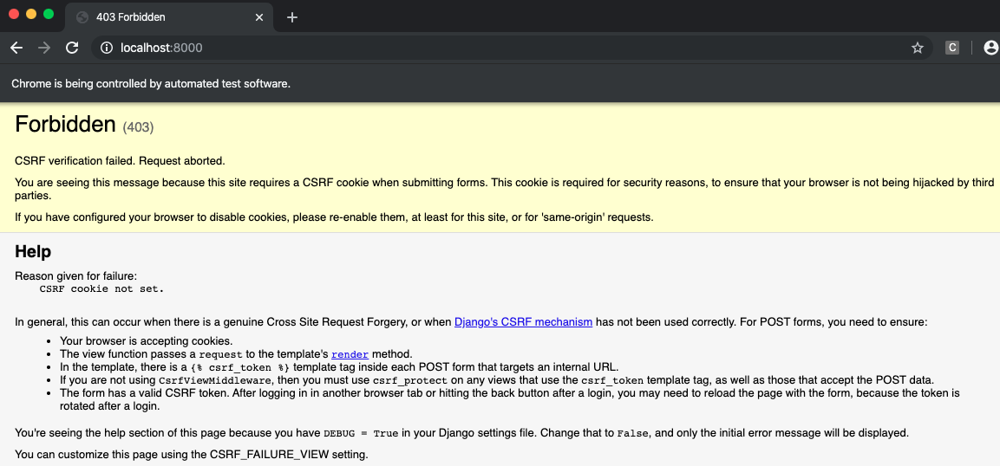

# 5장 사용자 입력 저장하기

## Intro

다시 한번 강조! TDD의 핵심은 **한 번에 한가지만 하는 것**

기능 테스트에 최소한의 기능만 구현

이번장에서 보여줄 것은?

- 사용자가 입력한 작업 아이템을 서버로 보내고 이를 저장한 후 다시 사용자에게 보여주는 시스템
- TDD 가 어떻게 반복적인 개발 스타일을 지원하는지 => 가장 빠른 방법은 아니나 결과적으로 개발 속도를 높여줌.
- 장고 모델, POST 요청처리, 장고 템플릿 테그 같은새로운 개념 소개

## POST 요청을 전송하기 위한 폼(Form) 연동(예제 : [05-01](./05-01))

4장 마지막에서 하지못했던 사용자 입력 기능을 구현해보도록 한다. 

바로 아래 기능 테스트 부분이다.

```py
        # 그녀는 바로 작업을 추가하기로 한다.
        inputbox = self.browser.find_element_by_id('id_new_item')
        self.assertEqual(
            inputbox.get_attribute('placeholder'),
            '작업 아이템 입력'
            )

        # "공작깃털 사기" 라고 텍스트 상자에 입력한다.
        # (에디스의 취미는 날치 잡이용 그물을 만드는 것이다)
        inputbox.send_keys('공작깃털 사기')

        # 엔터키를 치면 페이지가 갱신되고 작업 목록에
        # "1: 공작깃털 사기" 아이템이 추가된다
        inputbox.send_keys(Keys.ENTER)

        table = self.browser.find_element_by_id('id_list_table')
        rows = table.find_elements_by_tag_name('tr')
        self.assertTrue(
            any(row.text == '1: 공작깃털 사기' for row in rows),
            '신규 작업이 테이블에 표시되지 않는다'
            )
```

브라우저가 POST 요청을 보내기 위해서는

  - `<input>` 속성에 name= 속성을 지정
  - `<form>` 테그로 감싸야 함
  - `<form>` 테그에 method="POST" 지정해서 전송 방식 설정

이 내용을 반영한 내용이 아래에 링크되어 있다.

[lists/templates/home.html](05-01/superlists/lists/templates/home.html)

이제 반영이 되었으니 기능 테스트를 돌려본다.

```sh
$ python functional_test.py
E
======================================================================
ERROR: test_can_start_a_list_and_retrieve_it_later (__main__.NewVisitorTest)
----------------------------------------------------------------------
Traceback (most recent call last):
  File "functional_test.py", line 39, in test_can_start_a_list_and_retrieve_it_later
    table = self.browser.find_element_by_id('id_list_table')
  File "/Users/pilhwankim/.pyenv/versions/tdd-with-python-env/lib/python3.7/site-packages/selenium/webdriver/remote/webdriver.py", line 360, in find_element_by_id
    return self.find_element(by=By.ID, value=id_)
  File "/Users/pilhwankim/.pyenv/versions/tdd-with-python-env/lib/python3.7/site-packages/selenium/webdriver/remote/webdriver.py", line 978, in find_element
    'value': value})['value']
  File "/Users/pilhwankim/.pyenv/versions/tdd-with-python-env/lib/python3.7/site-packages/selenium/webdriver/remote/webdriver.py", line 321, in execute
    self.error_handler.check_response(response)
  File "/Users/pilhwankim/.pyenv/versions/tdd-with-python-env/lib/python3.7/site-packages/selenium/webdriver/remote/errorhandler.py", line 242, in check_response
    raise exception_class(message, screen, stacktrace)
selenium.common.exceptions.NoSuchElementException: Message: no such element: Unable to locate element: {"method":"css selector","selector":"[id="id_list_table"]"}
  (Session info: chrome=78.0.3904.108)

----------------------------------------------------------------------
Ran 1 test in 7.253s

FAILED (errors=1)
```

이전에 보지 못했던 몇가지 특이한 에러(그리고 현상)들이 나온다.

이 에러들을 파악해보려면 몇가지 디버깅 방법이 있다.

- print 문을 이용해 현재 페이지 텍스트 확인하기
- 에러 메시지를 개선해서 더 자세한 정보를 출력하기
- 수동으로 사이트를 열어보기
- time.sleep을 이용해 실행중에 있는 테스트를 잠시 정지시키기

여기서 마지막 sleep을 사용해보도록 한다.

[functional_test.py - sleep 추가](./05-01/functional_test.py)

기능 테스트를 다시 실행하면 브라우저가 10초 정도 멈추게 되는데 다음과 같은 화면이 나온다.



장고는 CSRF 보호를 기본으로 지원한다. CSRF에 대해서는 [CSRF 란?](https://ko.wikipedia.org/wiki/%EC%82%AC%EC%9D%B4%ED%8A%B8_%EA%B0%84_%EC%9A%94%EC%B2%AD_%EC%9C%84%EC%A1%B0) 을 참고하자.

CSRF 보호를 위해 장고는 각 폼이 생성하는 POST 요청에 토큰을 부여한다.

현재 방금 form에 그 처리가 되어 있지 않아 이 에러가 `CSRF validation fail` 이 발생한 것이다.

장고는 이 기능도 간편하게 제공한다. CSRF 전용 **템플릿 테그**를 추가한다.

[lists/templates/home.html](./05-01/superlists/lists/templates/home.html)

장고 내부에서는 이 테그를 CSRF 토근을 포함하는 `<input type="hidden">` 요소로 변경해서 랜더링한다.

다시 기능 테스트를 돌려보면 브라우저의 CSRF 에러는 나오지 않는다.

하지만 테스트 결과는 Fail 이 된다.

```sh
$ python functional_test.py
F
======================================================================
FAIL: test_can_start_a_list_and_retrieve_it_later (__main__.NewVisitorTest)
----------------------------------------------------------------------
Traceback (most recent call last):
  File "functional_test.py", line 47, in test_can_start_a_list_and_retrieve_it_later
    '신규 작업이 테이블에 표시되지 않는다'
AssertionError: False is not true : 신규 작업이 테이블에 표시되지 않는다

----------------------------------------------------------------------
Ran 1 test in 16.030s

FAILED (failures=1)
```

이제 브라우저 동작을 확인했으니 time.sleep은 필요없으므로 제거하자.

## 서버에서 POST 요청 처리(예제 : [05-02](./05-02))

폼에 action= 속성 내용이 없는 상태에서 submit 을 하면?

method=POST 가 지정되어 있으므로 현재 동일 URL에 POST 방식으로 요청함

이것을 검증할 단위 테스트가 필요하다.

[lists/tests.py](./05-02/superlists/lists/tests.py) - 단위 테스트 추가

HttpRequest 내 속성 정리

- .method : HTTP 요청 메서드(string 타입)
- .POST : POST 메서드인 요청 http body 내용(dict 타입)

새로 단위 테스트를 추가했으므로 의도적인 실패가 일어나는지 확인하자

```sh
python manage.py test
Creating test database for alias 'default'...
System check identified no issues (0 silenced).
FF.
======================================================================
FAIL: test_home_page_can_save_a_POST_request (lists.tests.HomePageTest)
----------------------------------------------------------------------
Traceback (most recent call last):
  File "/Users/pilhwankim/Github/books/test_driven_development_with_python/ch05/05-02/superlists/lists/tests.py", line 28, in test_home_page_can_save_a_POST_request
    self.assertIn('신규 작업 아이템', response.content.decode())
AssertionError: '신규 작업 아이템' not found in '<html>\n    <head>\n        <title>To-Do lists</title>\n    </head>\n    <body>\n        <h1>Your To-Do list</h1>\n        <form method="POST">\n            <input name="item_text" id="id_new_item" placeholder="작업 아이템 입력">\n            <input type="hidden" name="csrfmiddlewaretoken" value="67JC67qNcs6bsJlmhjMGrbMSvevTJ7qYVFfbZlGQ9WPLwK82e9r0jFfpSD9XJAUt">\n        </form>\n\n        <table id="id_list_table">\n        </table>\n    </body>\n</html>'

======================================================================
FAIL: test_home_page_returns_correct_html (lists.tests.HomePageTest)
----------------------------------------------------------------------
Traceback (most recent call last):
  File "/Users/pilhwankim/Github/books/test_driven_development_with_python/ch05/05-02/superlists/lists/tests.py", line 18, in test_home_page_returns_correct_html
    self.assertEqual(response.content.decode(), expected_html)
AssertionError: '<htm[227 chars]     <input type="hidden" name="csrfmiddleware[171 chars]tml>' != '<htm[227 chars]     \n        </form>\n\n        <table id="i[50 chars]tml>'

----------------------------------------------------------------------
Ran 3 tests in 0.006s

FAILED (failures=2)
Destroying test database for alias 'default'...
```

예상치 못한 상황이 발생했다. 보면 3개중 2개의 단위 테스트가 에러가 난다.

테스트 로그를 확인해보면 원인은 5장 맨처음 csrf tag를 넣음으로 템플릿 html 문자열과 응답 문자열(csrf input 이 포함된) 결과가 차이가 나서 생기는 실패이다.

이 차이는 어떻게 극복해야 하나?

스텍오버플로우에 관련 질문을 찾아보니 우회하는 방법이 있었다.

https://stackoverflow.com/questions/34629261/django-render-to-string-ignores-csrf-token/39859042#39859042

요약하면 `csrfmiddlewaretoken` 히든 필드를 테스트 코드에서 파이썬 정규표현식으로 제거하는 함수를 만드는 것이다.

```py
def remove_csrf(html_code):
    csrf_regex = r'&lt;input[^&gt;]+csrfmiddlewaretoken[^&gt;]+&gt;'
    return re.sub(csrf_regex, '', html_code)
```

lists/tests.py remove_csrf 함수를 다음과 같이 추가한다.

```py
    def test_home_page_returns_correct_html(self):
        #...생략...
        expected_html = render_to_string('home.html', request=request)
        self.assertEqual(remove_csrf(response.content.decode()), remove_csrf(expected_html))
```

테스트를 다시 돌려보면

```sh
$ python manage.py test
Creating test database for alias 'default'...
System check identified no issues (0 silenced).
F..
======================================================================
FAIL: test_home_page_can_save_a_POST_request (lists.tests.HomePageTest)
----------------------------------------------------------------------
Traceback (most recent call last):
  File "/Users/pilhwankim/Github/books/test_driven_development_with_python/ch05/05-02/superlists/lists/tests.py", line 36, in test_home_page_can_save_a_POST_request
    self.assertIn('신규 작업 아이템', response.content.decode())
AssertionError: '신규 작업 아이템' not found in '<html>\n    <head>\n        <title>To-Do lists</title>\n    </head>\n    <body>\n        <h1>Your To-Do list</h1>\n        <form method="POST">\n            <input name="item_text" id="id_new_item" placeholder="작업 아이템 입력">\n            <input type="hidden" name="csrfmiddlewaretoken" value="FO3gHv4cwdk1hJyTEmkpr5e3KGenddLiKNXz7K31FIcgFDOUi5tL47OXeohJW0Xs">\n        </form>\n\n        <table id="id_list_table">\n        </table>\n    </body>\n</html>'

----------------------------------------------------------------------
Ran 3 tests in 0.006s

FAILED (failures=1)
Destroying test database for alias 'default'..
```

이제 1가지 테스트 실패만 남았는데 이번에 추가한 테스트 코드이다.

이 것을 해결하려면 POST 요청을 처리하는 코드를 작성해야 한다.

제일 간단한 방식으로 반환값을 이용해서 해결해보자.

[lists/views.py](./05-02/superlists/lists/views.py)

```py
def home_page(request):
      return HttpResponse(request.POST['item_text'])
```

테스트는 모두 통과한다. 그러나 우리가 최종 원하는 결과는 아니다.

우리가 원하는 결과는 템플릿에 있는 새 TODO 리스트에 '신규 작업 아이템' 이 추가되는 것이다.

## 파이썬 변수를 전달해서 템플릿에 출력하기(예제 : [05-03](./05-03))

어떻게 '신규 작업 아이템'을 추가해야 할까?

장고는 템플릿 구문을 이용하면 파이썬 뷰 코드에 있는 변수를 그대로 추가 가능하다.

[lists/templates/home.html](./05-03/superlists/lists/templates/home.html)

```html
        <table id="id_list_table">
            <tr><td>{{ new_item_text }}</td></tr>
        </table>
```

뷰가 제대로 된 값을 new_item_text 에 전달하는지 어떻게 테스트 하는가?

render_to_string 함수를 이용한다.

[lists/tests.py](./05-03/superlists/lists/tests.py)

```py
        self.assertIn('신규 작업 아이템', response.content.decode())
        expected_html = render_to_string(
            'home.html',
            {'new_item_text': '신규 작업 아이템'}
        )
        self.assertEqual(remove_csrf(response.content.decode()), remove_csrf(expected_html))
```

render_to_string 두번째 인수에 변수명과 값을 매칭한 dict 를 넣는다.

이는 'new_item_text' 라는 변수를 home.html 템플릿의 {{new_item_text}} 를 값으로 치환시킨다.

다시 테스트를 돌려보면 실제 뷰 처리가 없어 실패한다. 다시 뷰 처리를 해보자.

[lists/views.py](./05-03/superlists/lists/views.py)

```py
def home_page(request):
    return render(request, 'home.html', {
        'new_item_text': request.POST.get('item_text', ''),
        })
```

다시 테스트를 돌려보자! 예상하지 못한 테스트 실패(에러) 가 나온다.

```sh
$ python manage.py test
Creating test database for alias 'default'...
System check identified no issues (0 silenced).
FE.
======================================================================
ERROR: test_home_page_returns_correct_html (lists.tests.HomePageTest)
----------------------------------------------------------------------
Traceback (most recent call last):
  File "/Users/pilhwankim/.pyenv/versions/tdd-with-python-env/lib/python3.7/site-packages/django/utils/datastructures.py", line 78, in __getitem__
    list_ = super().__getitem__(key)
KeyError: 'item_text'

During handling of the above exception, another exception occurred:

Traceback (most recent call last):
  File "/Users/pilhwankim/Github/books/test_driven_development_with_python/ch05/05-03/superlists/lists/tests.py", line 25, in test_home_page_returns_correct_html
    response = home_page(request)
  File "/Users/pilhwankim/Github/books/test_driven_development_with_python/ch05/05-03/superlists/lists/views.py", line 9, in home_page
    'new_item_text': request.POST['item_text']
  File "/Users/pilhwankim/.pyenv/versions/tdd-with-python-env/lib/python3.7/site-packages/django/utils/datastructures.py", line 80, in __getitem__
    raise MultiValueDictKeyError(key)
django.utils.datastructures.MultiValueDictKeyError: 'item_text'
```

공교롭게도 우리가 POST관련 내용을 변경하고 있을 때 **다른 테스트**에서 실패가 발생하였다. 이 결과로 방금의 POST 요청 처리 코드는 잘 못되었음을 발견 할 수 있다.

이것이 우리가 테스트를 작성해야 하는 이유이다. 테스트가 에플리케이션을 망가뜨릴수 있는 상황에서 우리를 구해주었다.

이 에러 케이스도 반영해서 다음과 같이 변경하자.

[lists/views.py](./05-03/superlists/lists/views.py)

```py
    return render(request, 'home.html', {
        'new_item_text': request.POST.get('item_text', ''),
        })
```

이제 단위 테스트는 통과한다. 기능 테스트는 어떤지 알아보자.

```sh
$ python functional_test.py
F
======================================================================
FAIL: test_can_start_a_list_and_retrieve_it_later (__main__.NewVisitorTest)
----------------------------------------------------------------------
Traceback (most recent call last):
  File "functional_test.py", line 45, in test_can_start_a_list_and_retrieve_it_later
    '신규 작업이 테이블에 표시되지 않는다'
AssertionError: False is not true : 신규 작업이 테이블에 표시되지 않는다

----------------------------------------------------------------------
Ran 1 test in 12.803s

FAILED (failures=1)
```

TF 디버깅 방법 "에러 메시지를 개선" 하는 방법을 사용하자.

[functional_test.py](./05-03/functional_test.py)

```py
        self.assertIn('1: 공작깃털 사기', [row.text for row in rows], 
            f'신규 작업이 테이블에 표시되지 않는다 -- 해당 텍스트:\n{table.text}'
        )
```

다음과 같이 유용한 메시지를 출력한다.

```sh
AssertionError: False is not true : 신규 작업이 테이블에 표시되지 않는다 -- 해당 텍스트:
공작깃털 사기
```

다시 테스트의 문제 해결로 돌아와보자. FT 가 실패하는 원인은 "1:"로 시작하는 첫번째 아이템을 원한다는 것이다. 약간의 편법을 동원하자.

[lists/templates/home.html](./05-03/superlists/lists/templates/home.html)
```html
        <table id="id_list_table">
            <tr><td>1: {{ new_item_text }}</td></tr>
        </table>
```

**finish the test!** 결과를 볼수 있다.

그러나.. 모두 알다시피 이런 꼼수는 2번째 아이템 등록에서는 동작하지 않는다. 2번째 아이템 등록 테스트를 추가해보자.

[functional_test.py](./05-03/functional_test.py)
```py
        # 그녀는 바로 작업을 추가하기로 한다.
        inputbox = self.browser.find_element_by_id('id_new_item')
        self.assertEqual(
            inputbox.get_attribute('placeholder'), 
            '작업 아이템 입력'
            )    

        # "공작깃털 사기" 라고 텍스트 상자에 입력한다.
        # (에디스의 취미는 날치 잡이용 그물을 만드는 것이다)
        inputbox.send_keys('공작깃털 사기')

        # 엔터키를 치면 페이지가 갱신되고 작업 목록에
        # "1: 공작깃털 사기" 아이템이 추가된다
        inputbox.send_keys(Keys.ENTER)

        import time
        time.sleep(2)

        # (에디스는 매우 체계적인 사람이다)
        inputbox = self.browser.find_element_by_id('id_new_item')
        inputbox.send_keys('공작깃털을 이용해서 그물 만들기')
        inputbox.send_keys(Keys.ENTER)

        import time
        time.sleep(2)
        # 페에제는 다시 갱신되고, 두 개 아이템이 목록에 보인다.
        table = self.browser.find_element_by_id('id_list_table')
        rows = table.find_elements_by_tag_name('tr')
        self.assertIn('1: 공작깃털 사기', [row.text for row in rows], 
            f'신규 작업이 테이블에 표시되지 않는다 -- 해당 텍스트:\n{table.text}'
        )
        self.assertIn(
            '2: 공작깃털을 이용해서 그물 만들기', 
            [row.text for row in rows], 
            f'신규 작업이 테이블에 표시되지 않는다 -- 해당 텍스트:\n{table.text}'
        )
```

예상된 실패를 보여준다.
```sh
$ python functional_test.py
F
======================================================================
FAIL: test_can_start_a_list_and_retrieve_it_later (__main__.NewVisitorTest)
----------------------------------------------------------------------
Traceback (most recent call last):
  File "functional_test.py", line 53, in test_can_start_a_list_and_retrieve_it_later
    f'신규 작업이 테이블에 표시되지 않는다 -- 해당 텍스트:\n{table.text}'
AssertionError: '1: 공작깃털 사기' not found in ['1: 공작깃털을 이용해서 그물 만들기'] : 신규 작업이 테이블에 표시되지 않는다 -- 해당 텍스트:
1: 공작깃털을 이용해서 그물 만들기

----------------------------------------------------------------------
Ran 1 test in 6.966s

FAILED (failures=1)
```

## 단위 테스트 주기 - 레드/그린/리팩터 그리고 삼각법

- 레드 : 실패할 단위 테스트를 작성함으로써 작업을 시작한다.
- 그린 : 이 테스트를 통과할 최소 코드를 작성한다. 편법도 상관없다.
- 리펙터링 : 이해할 수 있는 코드로 바꾼다.
  - 삼각법(Triangulation) : 방금 우리가 보여준 방식. 두번째 아이템도 추가해 본다.
