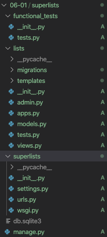
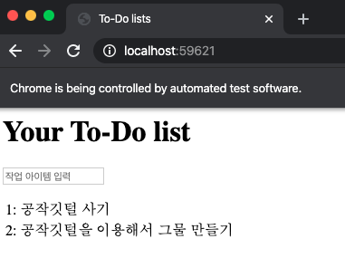
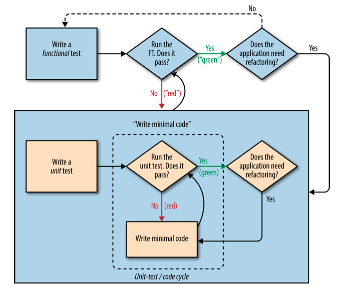

# 6장 최소 동작 사이트 구축

## Intro

이번장에 남은 일들

- 기능 테스트 후 남은 흔적(data) 제거
- 시스템이 하나의 목록만 지원하는 문제

## 기능 테스트 내에서 테스트 격리(예제 : [06-01](./06-01))

고전적 테스트 문제. 기능 테스트를 실행할 때마다 앞 테스트의 목록 아이템이 DB 에 남아있어 다음 테스트 결과를 방해함

해결 방식

1. 자체적인 솔루션을 적용하여 FT에 기존 결과물을 정리하는 코드를 작성하는 것
2. Django 에 탑재된 LiveServerTestCase 클래스를 이용하는 것

### LiveServerTestCase 클래스 동작

1. 자동으로 테스트용 데이터 베이스 생성
2. 기능 테스트를 위한 개발 서버를 가동
3. manage.py test 명령으로 실행 가능함

두 가지 해결방식중 LiveServerTestCase를 기능 테스트에 적용해보도록 한다

먼저 functional_tests.py를 장고 functional_tests 앱의 tests.py 로 이동시키는 작업을 해 보자.

```sh
$ cd superlists
$ mkdir functional_tests
$ touch functional_tests/__init__.py
```

장고 앱 디렉토리(혹은 파이썬 패키지)를 생성후 기존 기능 테스트 코드를 tests.py로 옮긴다.

```sh
$ cd ..
$ git mv functional_test.py superlists/functional_tests/tests.py
$ git status
```

현재 프로젝트 구조는 다음과 같이 변했다.



이제부터는 기능 테스트 실행은

`python functional_tests.py` 가 아니라

`python manage.py test functional_tests` 로 실행한다.

NewVisitorTest도 LiveServerTestCase를 상속하도록 테스트 코드도 변경해야 한다.

### [functional_tests/tests.py](./06-01/superlists/functional_tests/tests.py)

```py
from django.test import LiveServerTestCase
from selenium import webdriver
from selenium.webdriver.common.keys import Keys

class NewVisitorTest(LiveServerTestCase):
    
    def setUp(self):
   [...]
```

그리고 selenium 접속도 `localhost:8000` 대신에 LiveServerTestCase 제공하는 `self.live_server_url` 로 다시 세팅해야 한다.

```py
[...]
    def test_can_start_a_list_and_retrieve_it_later(self):
        # 에디스(Edith)는 멋진 작업 목록 온라인 앱이 나왔다는 소식을 듣고
        # 해당 웹 사이트를 확인하러 간다.
        self.browser.get(self.live_server_url)
        [...]
```

아래 부분도 없애도 된다. 테스트 실행을 장고 manage.py에서 대신하기 때문이다.

```py

if __name__ == '__main__':
    unittest.main(warnings='ignore')
```

변경이 다 되면 처음으로 바뀐 기능 테스트를 실행해 본다.

`python manage.py test functional_tests` 로 실행한다.

```sh
python manage.py test functional_tests
Creating test database for alias 'default'...
System check identified no issues (0 silenced).
F
======================================================================
FAIL: test_can_start_a_list_and_retrieve_it_later (functional_tests.tests.NewVisitorTest)
----------------------------------------------------------------------
Traceback (most recent call last):
  File "/Users/pilhwankim/Github/books/test_driven_development_with_python/ch06/06-01/superlists/functional_tests/tests.py", line 64, in test_can_start_a_list_and_retrieve_it_later
    self.fail('Finish the test!')
AssertionError: Finish the test!

----------------------------------------------------------------------
Ran 1 test in 7.799s

FAILED (failures=1)
Destroying test database for alias 'default'...
```

리펙터링 전과 같이 self.fail에 걸리며 통과 한다.

두번째 실행해보면 첫번째 실행한 목록이 남아있지 않은 것을 발견한다.



좋은 소식이 있다. 이제부터는 `manage.py test` 를 실행하면 기능 테스트와 단위 테스트 동시에 실행된다

```sh
$ python manage.py test
Creating test database for alias 'default'...
System check identified no issues (0 silenced).
.......F
======================================================================
FAIL: test_can_start_a_list_and_retrieve_it_later (functional_tests.tests.NewVisitorTest)
----------------------------------------------------------------------
Traceback (most recent call last):
  File "/superlists/functional_tests/tests.py", line 64, in test_can_start_a_list_and_retrieve_it_later
    self.fail('Finish the test!')
AssertionError: Finish the test!

----------------------------------------------------------------------
Ran 8 tests in 7.119s

FAILED (failures=1)
Destroying test database for alias 'default'...
```

단위 테스트만 실행하려면 `python manage.py test lists`을 실행하면 된다.

```sh
$ python manage.py test lists
Creating test database for alias 'default'...
System check identified no issues (0 silenced).
.......
----------------------------------------------------------------------
Ran 7 tests in 0.018s

OK
Destroying test database for alias 'default'...
```

## 필요한 경우 최소한의 설계를 하자 - Agile 개발 방법

- TDD 와 애자일(Agile) 은 밀접한 관련이 있다.
- 이론보다는 실제 상황을 통해 문제를 해결하려는 방식
- 긴 설계 과정 대신 "동작하는 최소한의 애플리케이션" 을 빠르게 만들고, 이를 이용해 얻은 실제 사용자 의견을 설계에 점진적으로 반영하는 방식
- 그러나 설계를 생각하지 않는 것은 아님
- 설계를 생각해서 해답을 빠르게 낼수 있다면 그렇게 해야 함

### 최소한의 기능을 가진 To-Do 앱(설계)

- 각 사용자별 개별 목록을 저장하도록 한다.
- 하나의 목록은 어러 개의 작업 아이템으로 구성된다. 이 아이템들은 작업 내용을 설명하는 텍스트다.
- 다음 방문 시에도 목록을 확인할 수 있도록 목롣을 저장해두어야 한다. 현 시점에선 각 목록에 해당하는 개별 URL을 사용자에게 제공하도록 한다. 이후에는 사용자를 자동으로 인식해서 해당 목록을 보여주도록 수정할 필요가 있다.

### YAGNI(You ain't gonna need it - "야그니" 라고 읽음)

- 아이디어가 아무리 좋더라도 대게 사용자가 사용하지 않으면 의미가 없다.
- 오히려 사용하지 않는 코드가 가득차서 앱이 복잡해지기만 한다.
- 아이디어를 억제하고 설계/개발을 최소화하는 것을 의미한다.

### REST(Representational State Transfer)

- 웹 설계 방법 중 하나
- 데이터 구조를 URL 구조에 일치시키는 방식
- 예시
  - To-Do 리스트 URL : `GET /lists/<목록 식별자>/`
  - 새로운 목록 만들기 : `POST /lists/new/`
  - 기존 목록에 새로운 작업 아이템 추가 : `POST /lists/<>/add_item`

추가하자면, REST의 정의에는 맞진 않는 설명이나, 이 책은 TDD를 주제로 하는 책이므로 이 정도 intro 설명으로 마무리하자.(이 친구가 상당히 논쟁거리이므로...)

## TDD를 이용한 새로운 설계 반영하기(예제 : [06-02](./06-02))

위의 설계 사항을 보고 우리가 앞으로 할 일을 다음과 같이 정리 가능하다.

### 작업 메모장

- [x] ~~FT가 끝난 후에 결과물을 제거한다~~
- [ ] 모델을 조정해서 아이템들이 다른 목록과 연계되도록 한다
- [ ] 각 목록별 고유 URL을 추가한다
- [ ] POST를 이용해서 새로운 목록을 생성하는 URL을 추가한다
- [ ] POST를 이용해서 새로운 아이템을 기존 목록에 추가하는 URL을 만든다.

새로운 기능과 설계를 적용하기 위해서, 4장에서 보았던 TDD 프로세스를 다시 한번 보자.



1장~6장 첫번째 예제까지 우리는 FT 단위의 TDD 프로세스를 한바퀴 돌았다(사실 2번 했다.)

이걸 다시 언급하는 이유는 이 프로세스가 저런 설계 명세가 있는 개발도 TDD 프로세스가 작동함을 저자가 보여주고 싶어서 인것 같다.

다시 FT 로 돌아와서 에디스가 첫 번째 아이템을 만들자 마자 새로운 목록을 만들어서 신규 작업 아이템을 추가한다.

그리고 그녀가 만든 목록에 접근할 URL을 제공하도록 FT 에 추가해 보자.

### [functional_tests/tests.py](./06-02/superlists/functional_tests/tests.py)

```py
[...]
        # 엔터키를 누르면 새로운 URL로 바뀐다. 그리고 작업 목록에
        # "1: 공작깃털 사기" 아이템이 추가된다
        inputbox.send_keys(Keys.ENTER)
        
        import time
        time.sleep(2)
        
        edith_list_url = self.browser.current_url
        self.assertRegex(edith_list_url, '/lists/.+')
        self.check_for_row_in_list_table('1: 공작깃털 사기')
[...]
```

그리고 테스트 마지막 부분을 수정해서 다른 사용자가 접속하는 경우를 고려한다.

- 다른 사람이 접속할 경우 에디스의 목록이 보이지 않는 것을 확인
- 각 사용자별 별도 URL이 생성되는지 여부 확인

self.fail 앞에 있는 주석 부터 지우고 다음과 같이 입력한다.

```py
        [...]
        # 페이지는 다시 갱신되고, 두 개 아이템이 목록에 보인다.
        self.check_for_row_in_list_table('1: 공작깃털 사기')
        self.check_for_row_in_list_table('2: 공작깃털을 이용해서 그물 만들기')

        # 새료운 사용자인 프란시스가 사이트에 접속한다.

        ## 새로운 브라우저 세션을 이용해서 에디스의 정보가
        ## 쿠키를 통해 유입되는 것을 방지한다
        self.browser.quit()
        self.browser = webdriver.Chrome('chromedriver')

        # 프란시스가 홈페이지에 접속한다.
        # 에디스의 리스트는 보이지 않는다.
        self.browser.get(self.live_server_url)
        page_text = self.browser.find_element_by_tag_name('body').text
        self.assertNotIn('공작깃털 사기', page_text)
        self.assertNotIn('공작깃털을 이용해서 그물 만들기', page_text)

        # 프란시스가 새로운 작업 아이템을 입력하기 시작한다.
        # 그는 에디스보다 재미가 없다.
        inputbox = self.browser.find_element_by_id('id_new_item')
        inputbox.send_keys('우유 사기')
        inputbox.send_keys(Keys.ENTER)

        # 프란시스가 전용 URL을 취득한다.
        francis_list_url = self.browser.current_url
        self.assertRegex(francis_list_url, '/lists/.+')
        self.assertNotEqual(francis_list_url, edith_list_url)
        
        # 에디스가 입력한 흔적이 없다는 것을 다시 확인한다.
        page_text = self.browser.find_element_by_tag_name('body').text
        self.assertNotIn('공작깃털 사기', page_text)
        self.assertIn('우유 사기', page_text)      

        # 만족하고 잠자리에 든다.
        [...]
```

FT를 실행해보면 예상되는 실패 결과가 나온다.

```sh
$ python manage.py test functional_tests
Creating test database for alias 'default'...
System check identified no issues (0 silenced).
F
======================================================================
FAIL: test_can_start_a_list_and_retrieve_it_later (functional_tests.tests.NewVisitorTest)
----------------------------------------------------------------------
Traceback (most recent call last):
  File "/Users/pilhwankim/Github/books/test_driven_development_with_python/ch06/06-02/superlists/functional_tests/tests.py", line 48, in test_can_start_a_list_and_retrieve_it_later
    self.assertRegex(edith_list_url, '/lists/.+')
AssertionError: Regex didn't match: '/lists/.+' not found in 'http://localhost:56148/'

----------------------------------------------------------------------
Ran 1 test in 6.322s

FAILED (failures=1)
Destroying test database for alias 'default'...
```

## Django 테스트 클라이언트를 이용한 뷰, 템플릿, URL 동시 테스트(예제 : [06-03](./06-03))

지금까지 단위 테스트 방식

1. URL 해석(라우팅) 의도대로 되는지 검증
2. 실제 뷰 함수 호출하여 동작하는지 검증
3. 뷰가 템플릿을 제대로 렌더링하는지 확인

But! Django는 이 3가지를 한번에 테스트 할 수 있는 툴이 존재! (두둥!! 왜 이 삽질을...)

저자 왈, 장고의 세부적인 동작(기반 기술)을 이해하기 위함이라고 한다.

자 위에 언급한 신박한(?) 툴을 적용해 보자~! 새로운 테스트 클래스를 추가한다.

### [lists/tests.py](./06-03/superlists/lists/tests.py)

```py
[..]
class ListViewTest(TestCase):

    def test_displays_all_list_items(self):
        Item.objects.create(text='itemey 1')
        Item.objects.create(text='itemey 2')

        response = self.client.get('/lists/the-only-list-in-the-world/')

        self.assertContains(response, 'itemey 1')
        self.assertContains(response, 'itemey 2')

```

- 뷰 호출 대신 self.client(테스트 클라이언트) 로 대체하고 있다. HTTP get 요청을 동일하게 한다.
- assertIn/response.content.decode() 대신 장고가 제공하는 assertContains 메소드를 사용하는데 알아서 response 객체를 해석해준다.

테스트를 실행하면 의도적 실패가 일어난다.

```sh
$ python manage.py test lists
[..]
AssertionError: 404 != 200 : Couldn't retrieve content: Response code was 404 (expected 200)
```

이 에러가 난 이유는 URL 이 아직 존재하지 않기 때문이다. url을 추가해 보자.

### [superlists/urls.py](./06-03/superlists/superlists/urls.py)

```py
[...]
urlpatterns = [
    # path('admin/', admin.site.urls),
    path('', home_views.home_page, name='home'),
    path('lists/the-only-list-in-the-world/', home_views.view_list, name='view_list'),
]
```

url 도 만들었으니 다시 단위 테스트를 실행해보자. 

```sh
  File "/superlists/superlists/urls.py", line 23, in <module>
    path('lists/the-only-list-in-the-world/', home_views.view_list, name='view_list'),
AttributeError: module 'lists.views' has no attribute 'view_list'
```

실행하면 `view_list` 가 없다는 결과가 나온다. view 도 추가하자.

### [lists/views.py](./06-03/superlists/lists/views.py)

```py
[..]

def view_list(request):
    pass
```

다시 테스트를 실행해보자.

```sh
[..]
    "returned None instead." % (callback.__module__, view_name)
ValueError: The view lists.views.view_list didn't return an HttpResponse object. It returned None instead.
```

리턴이 없다고 메시지를 보낸다. `home_page` 뷰의 마지막 2줄을 그대로 가져요자.

```py
def view_list(request):
    items = Item.objects.all()
    return render(request, 'home.html', {'items': items})
```

다시 테스트를 실행하면 성공한다.

```sh
$ python manage.py test lists
[..]
Ran 8 tests in 0.029s

OK
```

아직은 FT를 실행하면 통과하지 못한다.

```sh
$ python manage.py test functional_tests
[..]
AssertionError: Regex didn't match: '/lists/.+' not found in 'http://localhost:49423/'

```

### 그린? 아니면 리팩터?

단위 테스트는 현재 `레드/그린/리팩터` 중에 `그린` 인 상태이다. 이제 해야할 일은 `리펙터링` 인데 필요한 부분이 있는지 살펴봐야 한다.

현재 2개 뷰(home_page, view_list) 를 살펴보면 get방식일 경우 같은 템플릿을 사용하며, Item은 동일한 내용으로 전달한다.

그런 점으로 보자면 단위 테스트 2개가 필요한 상황은 아니다.

`test_home_page_displays_all_list_items` 은 중복으로 필요는 없다. 

삭제하고 다시 단위 테스트를 돌려보자.

```sh
$ python manage.py test lists
Ran 7 tests in 0.027s
```

8개에서 7개로 단위 테스트가 줄었다.

### 목록 출력을 위한 별도 템플릿

이제 메인 페이지와 목록 화면이 별개의 개념으로 가기로 했기에 각각 별개의 템플릿을 사용하도록 해보자.

- `home.html` - 홈 화면, 하나의 입력 상자
- `list.html` - 아이템들을 보여주는 테이블

먼저 테스트 부터 추가해보자.

### [lists/tests.py](./06-03/superlists/lists/tests.py)

```py
class ListViewTest(TestCase):
    def test_uses_list_tempate(self):
        response = self.client.get('/lists/the-only-list-in-the-world/')
        self.assertTemplateUsed(response, 'list.html')

    def test_displays_all_list_items(self):
[..]
```

assertTemplateUsed - django test client 가 제공하는 템플릿 일치 여부 함수

추가하고 바로 테스트를 돌려보면...

```sh
AssertionError: False is not true : Template 'list.html' was not a template used to render the response. Actual template(s) used: home.htm
```

의도한 실패가 나온다. view 단에서 이제 고쳐보자.

### [lists/views.py](./06-03/superlists/lists/views.py)

```py
[..]
def view_list(request):
    items = Item.objects.all()
    return render(request, 'list.html', {'items': items})
[..]
```

변경 후에 다시 테스트를 시도해보자

```sh

django.template.exceptions.TemplateDoesNotExist: list.html
```

예상했겠지만 list.html 템플릿이 없어서 익셉션이 난다. list.html 템플릿을 만들어보자.

현재는 home.html과 별 차이가 없기에 파일을 복사해서 사용한다.

```sh
$ cp lists/templates/home.html lists/templates/list.html
```

복사 후에 단위 테스트를 돌려보면 통과한다(그린단계). 자 이제 리팩토링을 할 것이 없는지 확인해보자.

이제 메인 페이지는 아이템 출력이 필요없기 때문에 필요없는 부분을 삭제해준다.

### [lists/templates/home.html](./06-03/superlists/lists/templates/home.html)

이와 동시에 홈 화면에 아이템을 검색할 필요가 없기에 `home_page` 뷰도 Item 검색을 삭제한다.

### [lists/views.py](./06-03/superlists/lists/views.py)

```py
[..]

def home_page(request):
    if request.method == 'POST':
        Item.objects.create(text=request.POST['item_text'])
        return redirect('/lists/the-only-list-in-the-world/')
    return render(request, 'home.html')
[..]
```

변경이 잘 이루어졌는지 단위 테스트를 돌려보자.

```sh
$ python manage.py test lists

Ran 8 tests in 0.070s

OK
```

성공한다. FT 도 확인해보자.

```sh
$  python manage.py test functional_tests
[..]
    self.assertIn(row_text, [row.text for row in rows])
AssertionError: '2: 공작깃털을 이용해서 그물 만들기' not found in ['1: 공작깃털 사기']
[..]
```

무엇이 문제일까? 

1. 첫번째 아이템은 홈 화면에서 입력한다. 
2. 리다이렉션이 일어나 URL `/lists/the-only-list-in-the-world/` 로 이동한다.
3. 이 화면에서 두번째 아이템을 입력한다.
4. 목록 조회화면 form 테그의 action이 없으므로  `POST /lists/the-only-list-in-the-world/`  요청으로 이어진다. 현재는 저 view 처리가 없다.

새 아이템 등록은 `POST /` 이므로 `list.html` 을 변경해보자.

### [lists/templates/list.html](./06-03/superlists/lists/templates/list.html)

```html
[..]
        <h1>Your To-Do list</h1>
        <form method="POST" action="/"">
            <input name="item_text" id="id_new_item" placeholder="작업 아이템 입력">
            
        </form>
[..]
```

```sh
$ python manage.py test functional_tests
Creating test database for alias 'default'...
System check identified no issues (0 silenced).
F
======================================================================
FAIL: test_can_start_a_list_and_retrieve_it_later (functional_tests.tests.NewVisitorTest)
----------------------------------------------------------------------
Traceback (most recent call last):
  File "/superlists/functional_tests/tests.py", line 86, in test_can_start_a_list_and_retrieve_it_later
    self.assertNotEqual(francis_list_url, edith_list_url)
AssertionError: 'http://localhost:49993/lists/the-only-list-in-the-world/' == 'http://localhost:49993/lists/the-only-list-in-the-world/'

----------------------------------------------------------------------
Ran 1 test in 10.656s

FAILED (failures=1)
Destroying test database for alias 'default'...
```

다시 이전 상태로 잘 돌아왔다. 리펙터링이 완료되었다.

작업 자체는 참 번거롭게 여러번 왔다 갔다 했지만 큰 진전이 있었다.

1가지 설계 사항을 원하는 대로 반영했기 때문이다.

## 목록 아이템을 추가하기 위한 URL과 뷰 (예제 : [06-04](./06-04))

### 신규 목록 생성을 위한 테스트 클래스


`test_home_page_can_save_a_POST_request`, `test_home_page_redirects_after_POST` 를 새로운 클래스로 이동한다. 새 클래스 명칭은 `NewListTest` 이다.

```py
class NewListTest(TestCase):
    def test_home_page_can_save_a_POST_request(self):
        request = HttpRequest()
        request.method = 'POST'
        [...]
    
    def test_home_page_redirects_after_POST(self):
        [...]
```

이 2가지 테스트를 Django 클라이언트 테스트를 이용하도록 변경한다.

#### [lists/tests.py](./06-04/superlists/lists/tests.py)

```py
class NewListTest(TestCase):
    def test_home_page_can_save_a_POST_request(self):
        self.client.post(
            '/lists/new',
            data={'item_text': '신규 작업 아이템'}
            )
        self.assertEqual(Item.objects.count(), 1)
        new_item = Item.objects.first()
        self.assertEqual(new_item.text, '신규 작업 아이템')
    
    def test_home_page_redirects_after_POST(self):
        response = self.client.post(
            '/lists/new',
            data={'item_text': '신규 작업 아이템'}
            )
        self.assertEqual(response.status_code, 302)
        self.assertEqual(response['location'], '/lists/the-only-list-in-the-world/')
```

테스트를 실행해보자. 아이템 추가하는 것과 관련된 테스트를 재 작성한 거나 마찬가지이다. 

결과는 의도한 실패가 2개 추가된다.

```py
$ python manage.py test lists
Creating test database for alias 'default'...
System check identified no issues (0 silenced).
......FF
======================================================================
FAIL: test_home_page_can_save_a_POST_request (lists.tests.NewListTest)
----------------------------------------------------------------------
Traceback (most recent call last):
  File "/Users/pilhwankim/github/books/test_driven_development_with_python/ch06/06-04/superlists/lists/tests.py", line 74, in test_home_page_can_save_a_POST_request
    self.assertEqual(Item.objects.count(), 1)
AssertionError: 0 != 1

======================================================================
FAIL: test_home_page_redirects_after_POST (lists.tests.NewListTest)
----------------------------------------------------------------------
Traceback (most recent call last):
  File "/Users/pilhwankim/github/books/test_driven_development_with_python/ch06/06-04/superlists/lists/tests.py", line 83, in test_home_page_redirects_after_POST
    self.assertEqual(response.status_code, 302)
AssertionError: 404 != 302

----------------------------------------------------------------------
Ran 8 tests in 0.029s

FAILED (failures=2)
```

잠깐 실패를 확인해보자.

첫 번째 실패는 아직 DB에 새 목록을 저장하지 못했다는 뜻이다. 이제야 유용하게 테스트 코드가 활용된다.

두 번째 실패는 lists/new 가 아직 url 지정되지 않아서 404 에러가 난다.

### 신규 목록 생성을 위한 URL과 뷰

먼저 urls.py에 url을 지정하자.

#### [superlists/urls.py](./06-04/superlists/superlists/urls.py)

```py
urlpatterns = [
    # path('admin/', admin.site.urls),
    path('', home_views.home_page, name='home'),
    path('lists/the-only-list-in-the-world/', home_views.view_list, name='view_list'),
    path('lists/new', home_views.new_list, name='new_list'),
]
```

테스트를 돌려보면

`AttributeError: module 'lists.views' has no attribute 'new_list'`

라고 view 가 없다고 나온다.

view를 추가해주자.

#### [lists/views.py](./06-04/superlists/lists/views.py)

```py
[...]
def new_list(request):
    Item.objects.create(text=request.POST['item_text'])
    return redirect('/lists/the-only-list-in-the-world/')
[...]
```

여기서 책 본문과 차이점이 있다.

책의 장고 1.7버전에서는 `response['location']` 이 URL이 도메인 까지 포함되어 결과가 나왔으나,

현재 2.2 버전에서는 동일하게 상대URL 만 표시되어 나와서 현재 결과로도 테스트 통과가 된다.

그러나 예제의 통일성과 좀 더 정확한 결과 측정을 위해서 `assertEqual` 문을 `assertRedirects`로 책과 동일하게 바꾼다.

```py
[...]
        # self.assertEqual(response['location'], '/lists/the-only-list-in-the-world/')
        self.assertRedirects(response, '/lists/the-only-list-in-the-world/')
```

테스트를 돌려보면 통과한다.

```sh
$ python manage.py test list
[...]
Ran 8 tests in 0.035s

OK
```

### 필요 없는 코드와 테스트 삭제

이제 리펙토링 할 차례가 왔다. 코드를 단순화하기위해 필요 없는 코드를 제거할 때이다.

먼저 `home_page` 뷰의 POST 요청은 이미 `new_list`로 옮겨왔으니 삭제 한다.

```py
[...]
def home_page(request):
    return render(request, 'home.html')
[...]
```

다시 테스트로 문제 없는지 확인하자.

```sh
$ python manage.py test list
[...]
Ran 8 tests in 0.035s

OK
```

문제 없이 잘 동작한다.

`test_home_page_only_saves_items_when_necessary` 도 이제는 의미가 없어졌다. 이 테스트도 삭제하자.

```py
$ python manage.py test list
[...]
Ran 7 tests in 0.040s

OK
```

자 코드 정리도 잘 마무리 되었다. 작업중 하나가 마무리 되었다.

### 작업 메모장

- [x] ~~FT가 끝난 후에 결과물을 제거한다~~
- [ ] 모델을 조정해서 아이템들이 다른 목록과 연계되도록 한다
- [ ] 각 목록별 고유 URL을 추가한다
- [x] ~~POST를 이용해서 새로운 목록을 생성하는 URL을 추가한다~~
- [ ] POST를 이용해서 새로운 아이템을 기존 목록에 추가하는 URL을 만든다.

## 모델 조정하기 (예제 : [06-05](./06-05))

자 이번에는 모델을 조정할 차례이다. 먼저 모델과 관련된 테스트들 부터 변경한다.

### [lists/tests.py](./06-05/superlists/lists/tests.py)

너무 이제 변경점을 관리하기 어려워져서 diff 툴을 쓰기로 했다.

앞에 `-` 는 이전 버전 코드

앞에 `+` 는 변경/추가 된 코드이다.

```py
@@ -6,7 +6,7 @@
 from django.template.loader import render_to_string

 from lists.views import home_page
-from lists.models import Item
+from lists.models import Item, List

 def remove_csrf(html_code):
     csrf_regex = r'<input[^>]+csrfmiddlewaretoken[^>]+>'
@@ -25,15 +25,22 @@
         self.assertEqual(remove_csrf(response.content.decode()), remove_csrf(expected_html))


-class ItemModelTest(TestCase):
+class ListAndItemModelTest(TestCase):
     def test_saving_and_retrieving_items(self):
+        list_ = List()
+        list_.save()
+
         first_item = Item()
         first_item.text = '첫 번째 아이템'
+        first_item.list = list_
         first_item.save()

         second_item = Item()
         second_item.text = '두 번째 아이템'
+        second_item.list = list_
         second_item.save()
+        saved_list = List.objects.first()
+        self.assertEqual(saved_list, list_)

         saved_items = Item.objects.all()
         self.assertEqual(saved_items.count(), 2)
@@ -42,7 +49,9 @@
         second_saved_item = saved_items[1]

         self.assertEqual(first_saved_item.text, '첫 번째 아이템')
+        self.assertEqual(first_saved_item.list, list_)
         self.assertEqual(second_saved_item.text, '두 번째 아이템')
+        self.assertEqual(second_saved_item.list, list_)


 class ListViewTest(TestCase):
```

### 코드 설명

- Item 을 담는 List(목록) 모델을 만들고 각 아이템에 .list 속성을 부여하여 자기가 속한 List 모델을 할당하고 있다.
- 목록이 제대로 저장되었는지와 두 개 작업 아이템이 목록에 제대로 할당되었는지 확인하는 코드이다.
- List 객체는 서로 비교하는 것이 가능한데 이 비교는 주로 모델을 PK(Primary Key)인 `.id` 가 같은지 확인한다.

자 이제 테스트 코드를 돌려보자.

```sh
ImportError: cannot import name 'List' from 'lists.models'
```

예상된 첫 에러는 모델이 없다는 import 에러이다. 고쳐보자.

### [lists/models.py](./06-05/superlists/lists/models.py)

```py
[...]
class List(models.Model):
    pass


class Item(models.Model):
[...]
```

추가후 바로 테스트를 돌려보면~

```sh
django.db.utils.OperationalError: no such table: lists_list
```

가 나온다. 이전에 한번 언급 했다시피 DB 마이그레이션 과정이 필요하다.

```sh
$ python manage.py makemigrations
Migrations for 'lists':
  lists/migrations/0003_list.py
    - Create model List
```

마이그레이션 과정을 거친후에 다시 테스트를 거치면 이런 에러가 발생한다.

```sh
    self.assertEqual(first_saved_item.list, list_)
AttributeError: 'Item' object has no attribute 'list'
```

### 외래 키 관계

Item에 .list 를 어떻게 부여해줄 수 있을까? 이렇게??

```py
class Item(models.Model):
    text = models.TextField(default='')
    list = models.TextField(defualt='')
```

모델이 바뀌었으니 마이그레이션을 하고 테스트를 실행해보자.

```sh
$ python manage.py test lists
Creating test database for alias 'default'...
System check identified no issues (0 silenced).
..F....
======================================================================
FAIL: test_saving_and_retrieving_items (lists.tests.ListAndItemModelTest)
----------------------------------------------------------------------
Traceback (most recent call last):
  File "/superlists/lists/tests.py", line 52, in test_saving_and_retrieving_items
    self.assertEqual(first_saved_item.list, list_)
AssertionError: 'List object (1)' != <List: List object (1)>
```

- 우리가 원하는 것 : `.list` List 객체 자체로 저장됨.
- 실제 결과 :  `.list`를 List객체의 문자열로 저장함.

장고에서 우리가 원하는 방법대로 되려면 어떻게 해야하는가?
정답 : models.ForeignKey를 이용하여 두 model간 관계를 만들어야 한다.

#### [lists/models.py](./06-05/superlists/lists/models.py)

```py
class Item(models.Model):
    text = models.TextField(default='')
    list = models.ForeignKey(List, default=None, on_delete=models.CASCADE)
```

다시 마이그레이션이 필요하다. 방금한 마이그래이션은 취소해야 하니 마이그래이션 파일을 지우고 시작한다.

```sh
rm lists/migrations/0004_item_list.py

$ python manage.py makemigrations lists
Migrations for 'lists':
  lists/migrations/0004_item_list.py
    - Add field list to item
```

변경 후에 테스트를 돌려보자.

### 나머지 세상을 위한 새로운 모델

```sh
 python manage.py test lists
Creating test database for alias 'default'...
System check identified no issues (0 silenced).
...E.EE
======================================================================
ERROR: test_displays_all_list_items (lists.tests.ListViewTest)
----------------------------------------------------------------------
[...]
django.db.utils.IntegrityError: NOT NULL constraint failed: lists_item.list_id

======================================================================
ERROR: test_home_page_can_save_a_POST_request (lists.tests.NewListTest)
----------------------------------------------------------------------
[...]
django.db.utils.IntegrityError: NOT NULL constraint failed: lists_item.list_id

======================================================================
ERROR: test_home_page_redirects_after_POST (lists.tests.NewListTest)
----------------------------------------------------------------------
[...]
django.db.utils.IntegrityError: NOT NULL constraint failed: lists_item.list_id

----------------------------------------------------------------------
Ran 7 tests in 0.120s

FAILED (errors=3)
Destroying test database for alias 'default'...
```

#### 결과 해석

- 우리가 목표한 `test_saving_and_retrieving_items` 테스트는 성공했으나 다른 뷰 테스트는 실패했다.
- 희망적인 것은 동일한 에러는 동일한 문제일 가능성이 있다.
- 저 에러를 구글링하고 해석해보면 이렇다.
- 각 Item 모델은 꼭 1개의 List를 가지고 있어야 하기 때문에 발생한다. 즉 List 없는 Item은 없다는 모델 선언 때문이다.

원인을 알았으니 이제 Test를 수정하여 문제를 해결해보자.

#### [lists/tests.py](./06-05/superlists/lists/tests.py)

```py
[...]
    def test_displays_all_list_items(self):
        list_ = List.objects.create()
        Item.objects.create(text='itemey 1', list=list_)
        Item.objects.create(text='itemey 2', list=list_)
[...]
```

테스트를 다시 돌려보면 2개로 실패가 준 걸 볼수 있다.

나머지 2개
(test_home_page_can_save_a_POST_request, test_home_page_redirects_after_POST)

는 view 단에서 고쳐야 한다.

#### [lists/views.py](./06-05/superlists/lists/views.py)

```py
from .models import (
    Item, List
)
[...]
def new_list(request):
    _list = List.objects.create()
    Item.objects.create(text=request.POST['item_text'], list=_list)
    return redirect('/lists/the-only-list-in-the-world/')
```

테스트가 통과한다.

```sh
$ python manage.py test lists
Ran 7 tests in 0.027s

OK
```

사실 view 단의 코드는 논리적으로는 잘못된 것이다. 

새로 item을 생성할 때마다 list가 생성되는 이상한 코드이다.

테스트 고트 님을 기억하자. 한번에 한 스텝씩 고치는 것. TDD의 기본이다.

자 한가지 일이 끝났다.

### 작업 메모장

- [x] ~~FT가 끝난 후에 결과물을 제거한다~~
- [x] ~~모델을 조정해서 아이템들이 다른 목록과 연계되도록 한다~~
- [ ] 각 목록별 고유 URL을 추가한다
- [x] ~~POST를 이용해서 새로운 목록을 생성하는 URL을 추가한다~~
- [ ] POST를 이용해서 새로운 아이템을 기존 목록에 추가하는 URL을 만든다.

## 각 목록이 하나의 고유 URL을 가져야 한다 (예제 : [06-06](./06-06))

`ListViewTest`를 수정하여 2 개의 테스트가 고유URL을 가리키도록 하자.

URL의 고유 식별자는 list 테이블의 id로 한다.

그리고 `test_displays_all_list_items` 은 이름을

`test_displays_only_items_for_that_list` 로 바꾼다.

#### [lists/tests.py](./06-06/superlists/lists/tests.py)

```py
 class ListViewTest(TestCase):
     def test_uses_list_tempate(self):
-        response = self.client.get('/lists/the-only-list-in-the-world/')
+        list_ = List.objects.create()
+        response = self.client.get(f'/lists/{list_.id}/')
         self.assertTemplateUsed(response, 'list.html')

-    def test_displays_all_list_items(self):
-        list_ = List.objects.create()
-        Item.objects.create(text='itemey 1', list=list_)
-        Item.objects.create(text='itemey 2', list=list_)
+    def test_displays_only_items_for_that_list(self):
+        correct_list = List.objects.create()
+        Item.objects.create(text='itemey 1', list=correct_list)
+        Item.objects.create(text='itemey 2', list=correct_list)
+        other_list = List.objects.create()
+        Item.objects.create(text='다른 목록 아이템 1', list=other_list)
+        Item.objects.create(text='다른 목록 아이템 2', list=other_list)

-        response = self.client.get('/lists/the-only-list-in-the-world/')
+        response = self.client.get(f'/lists/{correct_list.id}/')

         self.assertContains(response, 'itemey 1')
         self.assertContains(response, 'itemey 2')

+        self.assertNotContains(response, '다른 목록 아이템 1')
+        self.assertNotContains(response, '다른 목록 아이템 2')
+

 class NewListTest(TestCase):
     def test_home_page_can_save_a_POST_request(self):
```

이제 항상 했던 의도적인 실패가 나는지 확인해보자.

```sh
$ python manage.py test lists
======================================================================
FAIL: test_displays_only_items_for_that_list (lists.tests.ListViewTest)
----------------------------------------------------------------------
[...]
AssertionError: 404 != 200 : Couldn't retrieve content: Response code was 404 (expected 200)

======================================================================
FAIL: test_uses_list_tempate (lists.tests.ListViewTest)
----------------------------------------------------------------------
[...]
    self.fail(msg_prefix + "No templates used to render the response")
AssertionError: No templates used to render the response
```

실패의 원인은 아직 잘 알수 없다.

그러나 일단은 변경된 내용만 실패하는것으로 보아 테스트 코드에 맞는 앱 코드를 변경해야 할 차례가 되었다.

### URL에서 파라메터 취득하기

책의 내용이 오래되서 설명이 필요하다. 장고가 2.0 이후로 URL 패턴이 단순화되었다.
(2.0 릴리즈 문서 참고 : https://docs.djangoproject.com/en/3.0/releases/2.0/#simplified-url-routing-syntax)

현재 2.2 기준으로 따라하기를 진행하고 있기도 하고, 굳이 이전버전의 복잡한 방식을 따라할 필요가 없다. 자세한 내용은 여기를 참고하자.

- https://docs.djangoproject.com/en/2.2/topics/http/urls/

위에 링크를 따라가 예제를 보면 어떻게 할지 쉽게 알수 있다.

```py
urlpatterns = [
    path('articles/2003/', views.special_case_2003),
    path('articles/<int:year>/', views.year_archive),
    path('articles/<int:year>/<int:month>/', views.month_archive),
    path('articles/<int:year>/<int:month>/<slug:slug>/', views.article_detail),
]
```

위의 예제를 참고하면 `<int:year>` 처럼 :앞쪽은 type, 뒤쪽은 (view단으로 넘어올)파라메터 명으로 URL을 선언한다. (이전 방식은 정규표현식으로 되어 있어 직관적으로 선언하기 어렵다)

지금 우리가 하려는건 List의 id를 path variable로 지정하려는 것이므로 동일한 방식으로 선언하면 된다.

#### [superlists/urls.py](./06-06/superlists/superlists/urls.py)

url을 변경했으니 테스트를 돌려보자. 에러가 바뀌었고 에석하게 1개 에러가 더 생겼다.

```sh
TypeError: view_list() got an unexpected keyword argument 'list_id'
```

이 말은 `view_list` 에 argument가 필요하다는 의미이다. 장고는 path variable의 값을 함수의 파라메터로 받는다. 이걸 고쳐보자. 그리고 기왕 한 김에 List id 에 맞는 리스트조회도 할수 있도록 변경하자.

```py
[...]
- def view_list(request):
+ def view_list(request, list_id):
[...]
```

다시 테스트를 돌려보면 다른 에러가 난다.

```sh

AssertionError: 1 != 0 : Response should not contain '다른 목록 아이템 1'
```

곰곰히 생각해보면 `view_list`는 현재 모든 아이템을 표시하기 때문에 생기는 문제임을 알수 있다.
해당 list에 맞는 item만 조회하도록 로직을 변경하자.

```py
[...]
def view_list(request, list_id):
+   list_ = List.objects.get(id=list_id)
+   items = Item.objects.filter(list=list_)
-   items = Item.objects.all()
    return render(request, 'list.html', {'items': items})
[...]
```

#### [lists/views.py](./06-06/superlists/lists/views.py)

테스트 결과는 1개만 실패로 남는다.

```
======================================================================
FAIL: test_home_page_redirects_after_POST (lists.tests.NewListTest)
----------------------------------------------------------------------
AssertionError: 404 != 200 : Couldn't retrieve redirection page '/lists/the-only-list-in-the-world/': response code was 404 (expected 200)
```

### 새로운 세상으로 가기 위한 new_list 수정

이제 마지막 실패를 고쳐야 한다. 왜 실패가 생긴걸까?

조금만 더 코드를 거슬러 올라가 살펴보면 `new_list` 뷰가 새로 생긴 리스트 화면으로 리다이렉트를 한다. 

그러나 그 리다이렉트 URL이 방금 막 개발한 고유 URL 체계가 아닌  `/lists/the-only-list-in-the-world/` 로 고정되어 있다. 아직 맞게 고치지 않은 것이다.

그리고 테스트도 마찬가지로 `/lists/the-only-list-in-the-world/`를 기대값으로 가지고 있다. 새로운 기능에 따라 업데이트가 필요하다.

책 저자의 TDD 원칙대로 테스트 부터 고쳐보자.

```py

    def test_home_page_redirects_after_POST(self):
        response = self.client.post(
            '/lists/new',
            data={'item_text': '신규 작업 아이템'}
            )
-        self.assertEqual(response.status_code, 302)
-        self.assertRedirects(response, '/lists/the-only-list-in-the-world/')
+        new_list = List.objects.first()
+        self.assertRedirects(response, f'/lists/{new_list.id}/')
```

테스트를 돌려보면 아직 통과 하지 않는다. view 단을 고쳐보자.

#### [lists/views.py](./06-06/superlists/lists/views.py)

```py
[...]
def new_list(request):
    _list = List.objects.create()
    Item.objects.create(text=request.POST['item_text'], list=_list)
-    return redirect('/lists/the-only-list-in-the-world/')
+    return redirect(f'/lists/{_list.id}/')

```

이제 모든 단위 테스트가 통과한다. 

다시 기능 테스트로 돌아가보자.

```sh
$ python manage.py test functional_tests
======================================================================
FAIL: test_can_start_a_list_and_retrieve_it_later (functional_tests.tests.NewVisitorTest)
----------------------------------------------------------------------
Traceback (most recent call last):
  File "/superlists/functional_tests/tests.py", line 48, in test_can_start_a_list_and_retrieve_it_later
    self.assertRegex(edith_list_url, '/lists/.+')
AssertionError: Regex didn't match: '/lists/.+' not found in 'http://localhost:53797/'
```

다른 에러가 발생했다. 원래는 실패가 없었는데 기능추가/변경에 따라 없던 실패가 발생하는 것을 **애플리케이션 퇴행**이 발생했다고 한다.

현재 모든 아이템을 새로 만들때마다 하나의 목록을 만들기 때문에 에러가 발생하고 있다. 

일단 한가지 문제를 해결했으므로 작업 메모장 목록을 하나 지운다.

### 작업 메모장

- [x] ~~FT가 끝난 후에 결과물을 제거한다~~
- [x] ~~모델을 조정해서 아이템들이 다른 목록과 연계되도록 한다~~
- [x] ~~각 목록별 고유 URL을 추가한다~~
- [x] ~~POST를 이용해서 새로운 목록을 생성하는 URL을 추가한다~~
- [ ] POST를 이용해서 새로운 아이템을 기존 목록에 추가하는 URL을 만든다.

## 기존 목록에 아이템을 추가하기 위한 또 다른 뷰 (예제 : [06-07](./06-07))

(신규 목록이 아닌) 기존 목록에 신규 아이템을 추가하기 위한 URL과 뷰를 추가해보자.

### [lists/tests.py](./06-07/superlists/lists/tests.py)

먼저 테스트를 추가해보자.

```py
class NewItemTest(TestCase):
    def test_can_save_a_POST_request_to_an_existing_list(self):
        other_list = List.objects.create()
        correct_list = List.objects.create()

        self.client.post(
            f'list/{correct_list.id}/add_item',
            data={'item_text': '기존 목록에 신규 아이템'}
        )

        self.assertEqual(Item.objects.count(), 1)
        new_item = Item.objects.first()
        self.assertEqual(new_item.text, '기존 목록에 신규 아이템')
        self.assertEqual(new_item.list, correct_list)

    def test_redirects_to_list_view(self):
        other_list = List.objects.create()
        correct_list = List.objects.create()

        self.client.post(
            f'list/{correct_list.id}/add_item',
            data={'item_text': '기존 목록에 신규 아이템'}
        )

        self.assertRedirects(response, f'/lists/{correct_list.id}/')
```

결과는 의도적인 실패가 나온다.

```sh
======================================================================
FAIL: test_can_save_a_POST_request_to_an_existing_list (lists.tests.NewItemTest)
----------------------------------------------------------------------
AssertionError: 0 != 1

======================================================================
FAIL: test_redirects_to_list_view (lists.tests.NewItemTest)
----------------------------------------------------------------------
AssertionError: 404 != 302 : Response didn't redirect as expected: Response code was 404 (expected 302)
```

### 마지막 신규 URL

404(Not Found)는 URL 경로가 없다는 의미다. URL을 만들어보자.


#### [superlists/urls.py](./06-07/superlists/superlists/urls.py)

```py
urlpatterns = [
    path('', home_views.home_page, name='home'),
    path('lists/<int:list_id>/', home_views.view_list, name='view_list'),
    path('lists/new', home_views.new_list, name='new_list'),
+    path('lists/<int:list_id>/add_item', home_views.add_item, name='add_item'),
    # path('admin/', admin.site.urls), 
]
```

다시 테스트를 실행하면 `add_item` 뷰가 없다는 에러가 나온다.

```sh
AttributeError: module 'lists.views' has no attribute 'add_item'
```

뷰도 추가해주자.
```py
def add_item(request):
    pass
```

다시 테스트를 돌려보면 뷰에 `list_id` 파라메터가 필요하다고 한다. 

```sh
TypeError: add_item() got an unexpected keyword argument 'list_id'
```

추가해 주자

```py
def add_item(request, list_id):
    pass
```

테스트는 다음과 같다. 뷰의 return 값이 필요하다.

```sh
ValueError: The view lists.views.add_item didn't return an HttpResponse object. It returned None instead.
```

```py
def add_item(request, list_id):
    return redirect(f'/lists/{list_.id}/')
```

다시 테스트를 돌려보면 리다이렉트 체크 테스트는 통과하고, 아이템 갯수만 실패로 남는다.

마지막으로 신규 아이템 저장 작업을 추가한다.

#### [lists/views.py](./06-07/superlists/lists/views.py)

```py
def add_item(request, list_id):
    list_ = List.objects.get(id=list_id)
    return redirect(f'/lists/{_list.id}')
```

돌려보면 드디어 추가된 테스트 모두 통과한다.

```sh
Ran 9 tests in 0.034s

OK
```

### 폼에서 URL을 사용하는 방법

이제 현재 작업 목록에 아이템을 추가하는 form 테그를 만들면 UI에서 추가가 가능해진다.

#### [lists/templates/list.html](./06-07/superlists/lists/templates/list.html)

```html
-        <form method="POST" action="/">
+        <form method="POST" action="/lists/{{ list.id }}/add_item">
            <input name="item_text" id="id_new_item" placeholder="작업 아이템 입력">
            
        </form>
```

추가된 actions가 잘 동작하려면 뷰가 목록을 템플릿에게 전달하는 코드가 필요하다.

이것을 확인화기 위해 ListViewTest에 테스트를 추가하자.

#### [lists/tests.py](./06-07/superlists/lists/tests.py)

```py
class ListViewTest(TestCase):
    [...]
    def test_passes_correct_list_to_template(self):
        other_list = List.objects.create()
        correct_list = List.objects.create()
        response = self.client.get(f'/lists/{correct_list.id}/')
        self.assertEqual(response.context['list'], correct_list)
```

테스트를 추가해서 돌려보면 다음과 같은 에러가 나온다.

```sh
KeyError: 'list'
```

list에 템플릿을 전달하고 있지 않기 때문이다. 이 부분을 해결해보자.

```py
def view_list(request, list_id):
    list_ = List.objects.get(id=list_id)
    items = Item.objects.filter(list=list_)
-    return render(request, 'list.html', {'items': items})
+    return render(request, 'list.html', {'list': list_})
```

테스트가 또 다른 에러를 뱉어낸다.

```sh
AssertionError: False is not true : Couldn't find 'itemey 1' in response
```

템플릿에는 item도 표시해줘야 하는데 반영이 되지 않았기 때문이다. 이것도 변경해준다.

#### [lists/templates/list.html](./06-07/superlists/lists/templates/list.html)

```html

        <table id="id_list_table">
-            
+            
                <tr><td>{{forloop.counter}}: {{ item.text }}</td></tr>
            
        </table>
```

리스트에 속한 item은 장고 ORM 기본으로 .item_set 형식으로 불러올 수 있다.

이 내용은 다음 링크를 참조하자.

https://docs.djangoproject.com/en/2.2/topics/db/queries/#many-to-many-relationships

이제 단위 테스트는 완료되었다.

```sh
$ python manage.py test lists
Ran 10 tests in 0.039s

OK
```

그리고 FT도 통과한다.

```py
$ python manage.py test functional_tests
Creating test database for alias 'default'...
System check identified no issues (0 silenced).
.
----------------------------------------------------------------------
Ran 1 test in 9.369s

OK
Destroying test database for alias 'default'...
```

### 작업 메모장

- [x] ~~FT가 끝난 후에 결과물을 제거한다~~
- [x] ~~모델을 조정해서 아이템들이 다른 목록과 연계되도록 한다~~
- [x] ~~각 목록별 고유 URL을 추가한다~~
- [x] ~~POST를 이용해서 새로운 목록을 생성하는 URL을 추가한다~~
- [x] ~~POST를 이용해서 새로운 아이템을 기존 목록에 추가하는 URL을 만든다.~~
- [ ] urls.py 에 있는 중복 코드를 리팩터링한다.
