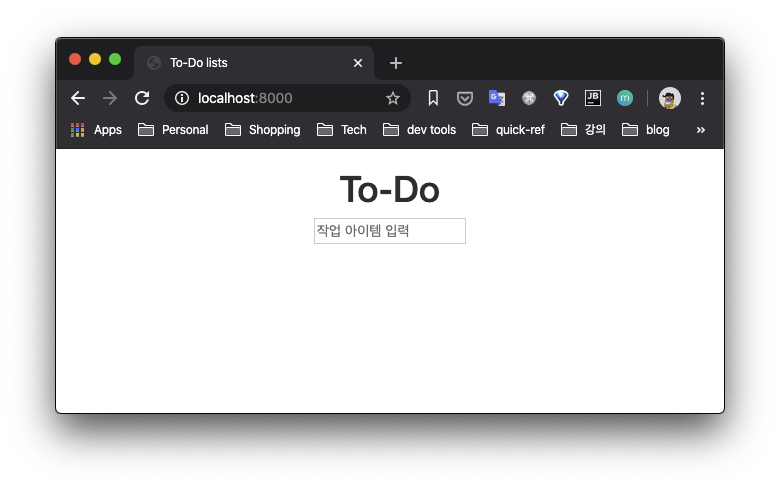
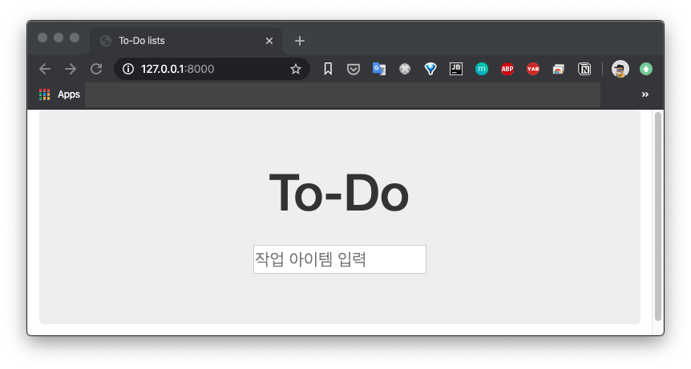

# 7장 멋있게 만들기: 레이아웃, 스타일링, 테스트

## 이번장에서 다루는 것

- 기본 css 방법
- 부트스트랩 프레임워크와 통합
- 장고의 static file 이 어떻게 동작하고 테스트 하는 방법

## 레이아웃과 스타일을 기능적으로 테스트하기(예제 : [07-01](./07-01))

좀 더 사이트를 멋지게 만들어보자. 그러려면 다음 2가지를 해야 한다.

- 신규 및 기존 목록 추가를 위한 크고 멋있는 입력 필드
- 크고 시선을 끄는 중앙 입력 박스

먼저 메인 입력상자가 각 페이지에 제대로 배치되는지 간단히 확인하는 테스트 부터 시작한다.

기능 테스트에 새로운 메소드를 추가한다.

### [functional_tests/tests.py](./07-01/superlists/functional_tests/tests.py)

```py

[...]
    def test_layout_and_styling(self):
        # 에디스는 메인 페이지를 방문한다
        self.browser.get(self.live_server_url)
        self.browser.set_window_size(1024, 768)

        # 그녀는 입력 상자가 가운데 배치된 것을 본다
        inputbox = self.browser.find_element_by_id('id_new_item')
        self.assertAlmostEqual(
            inputbox.location['x'] + inputbox.size('width') / 2,
            512,
            delta=10
        )
```

- 창 크기 고정시키고 있음
- input 요소가 페이지 중앙에 위치하는지 계산함. 오차범위 +-10 픽셀 내로 있으면 통과

기능 테스트를 실행해 보면...

```sh
$ python manage.py test functional_tests

======================================================================
FAIL: test_layout_and_styling (functional_tests.tests.NewVisitorTest)
----------------------------------------------------------------------
Traceback (most recent call last):
  File "/Users/pilhwankim/Github/books/test_driven_development_with_python/ch07/07-01/superlists/functional_tests/tests.py", line 105, in test_layout_and_styling
    delta=10
AssertionError: 64.0 != 512 within 10 delta (448.0 difference)
```

예상된 실패가 일어난다. 당분간 편법(!)을 사용하여 우회 통과하도록 하자.

### [lists/templates/home.html](./07-01/superlists/lists/templates/home.html)

```html
        <form method="POST" action="/lists/new">
+            <p style="text-align: center">
+                <input name="item_text" id="id_new_item" placeholder="작업 아이템 입력">
+            </p>
-            <input name="item_text" id="id_new_item" placeholder="작업 아이템 입력">
            
        </form>
```

변경하면 일단 FT는 통과한다.

```sh
$ python manage.py test functional_tests
Ran 2 tests in 13.215s

OK
```

신규 작업 목록 페이지에서도 입력 상자가 가운데 배치되는지 확인하는 것도 추가하자.

### [functional_tests/tests.py](./07-01/superlists/functional_tests/tests.py)

```py
        # 그녀는 새로운 리스트를 시작하고 입력 상자가
        # 가운데 배치된 것을 확인한다.
        inputbox.send_keys('testing')
        inputbox.send_keys(Keys.ENTER)
        inputbox = self.browser.find_element_by_id('id_new_item')
        self.assertAlmostEqual(
            inputbox.location['x'] + inputbox.size['width'] / 2,
            512,
            delta=10
        )
```

예상대로 또 다른 에러가 나온다.

```sh
AssertionError: 64.0 != 512 within 10 delta (448.0 difference)
```

이렇게 편법으로는 이제 통하지 않는다는 생각이 들 것이다.

편법으로 설계된 `<p style="tex-align: center">` 는 다시 원상복귀 한다.

## 멋있게 만들기: CSS 프레임워크 이용(예제 : [07-02](./07-02))

- 웹 페이지 디자인에 문외한인 개발자들의 대안 = CSS 프레임워크
- 부트스트랩(Bootstrap) = 가장 많이 사용

바로 적용해 보자. (최대한 책과 동일환경 동작하게 3버전을 사용)

```sh
$ wget -O bootstrap.zip https://github.com/twbs/bootstrap/releases/download/v3.3.2/bootstrap-3.3.2-dist.zip
$ unzip bootstrap.zip
$ mkdir lists/static
$ mv bootstrap-3.3.2-dist lists/static/bootstrap
$ rm bootstrap.zip
```

작업후 폴더는 다음과 같이 위치해야 한다.

```sh
lists
├── __init__.py
├── admin.py
├── apps.py
├── migrations
│   ├── 0001_initial.py
│   ├── 0002_item_text.py
│   ├── 0003_list.py
│   ├── 0004_item_list.py
│   └── __init__.py
├── models.py
├── static
│   └── bootstrap
│       ├── css
│       │   ├── bootstrap-theme.css
│       │   ├── bootstrap-theme.css.map
│       │   ├── bootstrap-theme.min.css
│       │   ├── bootstrap.css
│       │   ├── bootstrap.css.map
│       │   └── bootstrap.min.css
│       ├── fonts
│       │   ├── glyphicons-halflings-regular.eot
│       │   ├── glyphicons-halflings-regular.svg
│       │   ├── glyphicons-halflings-regular.ttf
│       │   ├── glyphicons-halflings-regular.woff
│       │   └── glyphicons-halflings-regular.woff2
│       └── js
│           ├── bootstrap.js
│           ├── bootstrap.min.js
│           └── npm.js
├── templates
│   ├── home.html
│   └── list.html
├── tests.py
├── urls.py
└── views.py
```

부트스트랩의 [온라인 공식 문서](http://bootstrapk.com/getting-started/#template)에 따라, HTML 템플릿에 다음과 같이 적용 가능하다.

```html
<!DOCTYPE html>
<html lang="ko">
  <head>
    <meta charset="utf-8">
    <meta http-equiv="X-UA-Compatible" content="IE=edge">
    <meta name="viewport" content="width=device-width, initial-scale=1">
    <!-- 위 3개의 메타 태그는 *반드시* head 태그의 처음에 와야합니다; 어떤 다른 콘텐츠들은 반드시 이 태그들 *다음에* 와야 합니다 -->
    <title>부트스트랩 101 템플릿</title>

    <!-- 부트스트랩 -->
    <link href="css/bootstrap.min.css" rel="stylesheet">

    <!-- IE8 에서 HTML5 요소와 미디어 쿼리를 위한 HTML5 shim 와 Respond.js -->
    <!-- WARNING: Respond.js 는 당신이 file:// 을 통해 페이지를 볼 때는 동작하지 않습니다. -->
    <!--[if lt IE 9]>
      <script src="https://oss.maxcdn.com/html5shiv/3.7.2/html5shiv.min.js"></script>
      <script src="https://oss.maxcdn.com/respond/1.4.2/respond.min.js"></script>
    <![endif]-->
  </head>
  <body>
    <h1>Hello, world!</h1>

    <!-- jQuery (부트스트랩의 자바스크립트 플러그인을 위해 필요합니다) -->
    <script src="https://ajax.googleapis.com/ajax/libs/jquery/1.11.2/jquery.min.js"></script>
    <!-- 모든 컴파일된 플러그인을 포함합니다 (아래), 원하지 않는다면 필요한 각각의 파일을 포함하세요 -->
    <script src="js/bootstrap.min.js"></script>
  </body>
</html>
```

이 프로젝트에 이미 두개의 HTML 템플릿을 가지고 있어서 각각 템플릿에 적용해야 한다.

하지만 이러한 중복은 `Don't Repeat Yourself` 규칙에 위배된다.

다행히 장고는 이런 템플릿 중복 문제해결 방안이 있다 - 템플릿 상속

## Django 템플릿 상속 (예제 : [07-03](./07-03))

`home.html` 과 `list.html` 템플릿은 같은(중복된) 내용이 많다.

```sh
$ diff lists/templates/home.html lists/templates/list.html
7,10c7,8
<         <form method="POST" action="/lists/new">
<             <p style="text-align: center">
<                 <input name="item_text" id="id_new_item" placeholder="작업 아이템 입력">
<             </p>
---
>         <form method="POST" action="/lists/{{ list.id }}/add_item">
>             <input name="item_text" id="id_new_item" placeholder="작업 아이템 입력">
12a11,16
>
>         <table id="id_list_table">
>             
>                 <tr><td>{{forloop.counter}}: {{ item.text }}</td></tr>
>             
>         </table>
```

두 템플릿의 다른점은

- form 이 다른 url 사용
- list.html 은 table 요소가 포함

이렇듯 다른점은 분리하고 공통점은 하나로 합치는 작업이 필요하다.

먼저 공통 템플릿을 작성해보자. 먼저 기존 템플릿을 복사한다.

```sh
$ cp lists/templates/home.html lists/templates/base.html
```

여기다 자식 템플릿이 들어갈 장소를 뜻하는 `blocks` 를 설정한다.

### [lists/templates/base.html](./07-03/superlists/lists/templates/base.html)

```html
<html>
    <head>
        <title>To-Do lists</title>
    </head>
    <body>
        <h1> </h1>
        <form method="POST" action=" ">
            <p style="text-align: center">
                <input name="item_text" id="id_new_item" placeholder="작업 아이템 입력">
            </p>
            
        </form>
        
        
    </body>
</html>
```

이제 공통영역은 base.html 에서 담당한다.

자식 템플릿(list.html, home.html) 은 blocks 에 해당하는 영역만 채우도록 변경한다.

### [lists/templates/home.html](./07-03/superlists/lists/templates/home.html)

```html


To-Do

/lists/new
```

### [lists/templates/list.html](./07-03/superlists/lists/templates/list.html)

```html


Your To-Do lists

/lists/{{ list.id }}/add_item


    <table id="id_list_table">
        
            <tr><td>{{forloop.counter}}: {{ item.text }}</td></tr>
        
    </table>

```

이제 변경한 내용이 잘 작동하는지 기능 테스트를 돌려서 확인하자.

```sh
$ python manage.py test functional_tests

AssertionError: 64.0 != 512 within 10 delta (448.0 difference)
```

여전히 실패는 남았으나 이전에도 있던 실패이므로 템플릿 리팩토링은 성공했다.

## 부트스트랩 통합하기 (예제 : [07-04](./07-04))

### 부트스트랩 CSS 적용

#### [lists/templates/base.html](./07-04/superlists/lists/templates/base.html)

```html
<html>
    <head>
        <title>To-Do lists</title>
+        <meta name="viewport" content="width=device-width, initial-sacle=1.0">
+        <link href="css/bootstrap.min.css" rel="stylesheet" media="screen">
    </head>
[...]
```

### 행(row)과 열(columns)

부트스트랩의 [그리드 시스템](http://bootstrapk.com/css/#grid)을 도입해 input, form, table 의 위치도 정리해보도록 하자.

#### [lists/templates/base.html](./07-04/superlists/lists/templates/base.html)

```html
[...]
    <body>
        <div class="container">
            <div class="row">
                <div class="col-md-6 col-md-offset-3">
                    <div class="text-center">
                        <h1> </h1>
                        <form method="POST" action=" ">
                            <p style="text-align: center">
                                <input name="item_text" id="id_new_item" placeholder="작업 아이템 입력">
                            </p>
                            
                        </form>
                    </div>
                </div>
            </div>
        </div>

        <div>
            
            
        </div>
    </body>
</html>
```

FT 를 돌려보면 CSS 적용되지 않아 화면이 그대로인 것을 확인 할수 있다.

왜 CSS 가 로딩되지 않는걸까?

## Django의 정적 파일 (예제 : [07-05](./07-05))

### 웹 서버에서 정적파일(Static File)을 다루는 2가지 고려사항

1. URL이 정적 파일을 위한 것인지 뷰 함수를 경유해 제공되는 HTML을 위한 것인지 구분 할 수 있는가?
2. 사용자가 원할 때 어디서 정적 파일을 찾을수 있는가?

정적 파일은 특정 URL을 디스크상에 있는 파일과 매칭시키는 역할을 한다

이 URL을 Django는 특정 URL의 접두사를 설정할 수 있다.

#### [superlists/settings.py](./07-05/superlists/superlists/settings.py)

```py
# Static files (CSS, JavaScript, Images)
# https://docs.djangoproject.com/en/2.2/howto/static-files/

STATIC_URL = '/static/'
```

Django 개발 서버(`manage.py runserver` 실행)는 실행시 각 장고앱의 하위 디렉토리들 중에 `static` 디렉토리 내용들을 전부 찾는다. 

그리고 그 찾은 정적 파일들을 `STATIC_URL` 하위에 있는 것처럼 기능한다.

그래서 실제 웹의 href path는 다르게 설정해야 한다.(Django 가 가리키는 path 체계를 따라야 한다.)

자 이제 css 링크가 되게 해보자.

#### [lists/templates/base.html](./07-05/superlists/lists/templates/base.html)

```html
        <meta name="viewport" content="width=device-width, initial-sacle=1.0">
-        <link href="css/bootstrap.min.css" rel="stylesheet" media="screen">
+        <link href="static/bootstrap/css/bootstrap.min.css" rel="stylesheet" media="screen">
    </head>
```

변경된 내용을 보면 이해가 될 것이다.

`STATIC_URL` 설정에 따라 장고 앱의 모든 정적파일들은 `/static/` URL 로 시작하는 path를 갖게 되는 것이다.

실제로 수동으로 접속해서 확인해 보자.

```sh
$ python manage.py runserver
```



### StaticLiveServerTestCase로 교체하기

변경후에 FT를 실행해보면 다음과 같이 실패한다.

```sh
TypeError: expected str, bytes or os.PathLike object, not NoneType
```

`runsever`가 자동으로 정적파일을 찾지만 `LiveServerTestCase`는 그렇지 못하기 때문에 발생한다.

테스트에서 `runserver`와 같이 자동으로 정적 파일을 찾아주는 테스트 클래스가 있다.

`StaticLiveServerTestCase`이다. 이걸로 FT도 교체해보자.

#### [functional_tests/tests.py](./07-05/superlists/functional_tests/tests.py)

```py
-from django.test import LiveServerTestCase
+from django.contrib.staticfiles.testing import StaticLiveServerTestCase
from selenium import webdriver
from selenium.webdriver.common.keys import Keys

-class NewVisitorTest(LiveServerTestCase):
+class NewVisitorTest(StaticLiveServerTestCase):

```

변경후에 FT 를 실행해보자.

```sh
$ python manage.py test functional_tests
Creating test database for alias 'default'...
System check identified no issues (0 silenced).
..
----------------------------------------------------------------------
Ran 2 tests in 14.083s

OK
```

OK~! 테스트가 통과한다.

## 부트스트랩 컴포넌트를 이용한 사이트 외형 개선 (예제 : [07-06](./07-06))

TO-DO 앱을 잘 꾸며보자.

### 점보트론

이렇게 생겼다. 특정 콘텐츠(메인 페이지와 해더)를 강조할 때 쓴다.


#### [lists/templates/base.html](./07-06/superlists/lists/templates/base.html)

```html
    <body>
        <div class="container">
            <div class="row">
-                <div class="col-md-6 col-md-offset-3">
+                <div class="col-md-6 col-md-offset-3 jumbotron">
                    <div class="text-center">
                        <h1> </h1>
                        <form method="POST" action=" ">
```

### 큰 입력 상자

강조는 되었지만 입력상자가 작다. 부트스트랩의 `form-control` 클래스를 적용하면 크게 만들수 있다.

#### [lists/templates/base.html](./07-06/superlists/lists/templates/base.html)

```html
<form method="POST" action=" ">
    <p style="text-align: center">
-        <input name="item_text" id="id_new_item" placeholder="작업 아이템 입력">
+        <input name="item_text" id="id_new_item" placeholder="작업 아이템 입력" class="form-control input-lg">
    </p>
    
</form>

```

### 테이블 스타일링

테이블의 글자도 너무 작다. `table` 클래스를 적용해 개선하자.

#### [lists/templates/list.html](./07-06/superlists/lists/templates/list.html)

```html
-    <table id="id_list_table">
+    <table id="id_list_table" class="table">
        
            <tr><td>{{forloop.counter}}: {{ item.text }}</td></tr>
        
    </table>
```

## 사용자 지정 CSS 사용하기 (예제 : [07-06](./07-06))

마지막으로 타이틀과 입력 상자 사이에 간격을 만들어보자. CSS 를 직접 지정해야 한다.

#### [lists/templates/base.html](./07-06/superlists/lists/templates/base.html)

```html
    <head>
        <title>To-Do lists</title>
        <meta name="viewport" content="width=device-width, initial-sacle=1.0">
        <link href="static/bootstrap/css/bootstrap.min.css" rel="stylesheet" media="screen">
+        <link href="static/base.css" rel="stylesheet" media="screen">
    </head>
```

#### [lists/static/base.css](./07-06/superlists/lists/static/base.css)

```css
#id_new_item {
    margin-top: 2ex;
}
```

다 적용했으면 최종 결과를 `manage.py runserver`로 확인해보자.



그리고 변경사항이 있으니 테스트로 제대로 동작하는지 확인하자.

```sh
$ python manage.py test functional_tests
Creating test database for alias 'default'...
System check identified no issues (0 silenced).
..
----------------------------------------------------------------------
Ran 2 tests in 14.300s

OK
```

모든 변경사항이 문제없음을 확인했다.

## collectstatic과 다른 정적 디렉터리 (예제 : [07-07](./07-07))

#### Django 개발 서버 static 폴더를 찾아서 제공하는 것

- 편하지만
- 성능이 떨어짐

#### 실제 운영 서버에서는

- 따로 웹서버(Nginx, Apache)에 저장해서 제공
- CDN에 업로드후 호스팅

이런 이유 때문에 프로젝트에 퍼져있는(앱 단위) 정적 파일을 한곳에 모아 배포해야 할 일이 생김

이 작업을 `manage.py collectstatic` 명령이 한다.

이 정적파일들이 모이는 path는 settings.py 의 `STATIC_ROOT` 이다.

책의 예제와 동일하게 `superlists` 프로젝트 루트 디렉토리와 동일 선상에 만들었다.

```sh
workspace
├── static
└── superlists
    ├── db.sqlite3
    ├── functional_tests
    │   ├── __init__.py
    │   ├── __pycache__
    │   │   ├── __init__.cpython-37.pyc
    │   │   └── tests.cpython-37.pyc
    │   └── tests.py
    ├── lists
    │   ├── __init__.py
```

#### [superlists/settings.py](./07-07/superlists/superlists/settings.py)

```py

# Static files (CSS, JavaScript, Images)
# https://docs.djangoproject.com/en/2.2/howto/static-files/

STATIC_URL = '/static/'
+ STATIC_ROOT = os.path.abspath(os.path.join(BASE_DIR, '../static'))
```

`BASE_DIR` 은 장고에서 기본으로 제공하는 세팅인데, 프로젝트 루트를 가리킨다.

이제 `collectstatic` 명령을 내려보자.

```sh
$ python manage.py collectstatic

134 static files copied to '/workspace/07-07/static'.
```

`tree` 명령어로 확인해보면 `workspace/static` 에 모든 정적파일이 합쳐졌다.

```sh
$ tree
.
├── static
│   ├── admin
│   │   ├── css
│   │   │   ├── autocomplete.css
[...]
└── superlists
    ├── db.sqlite3
    ├── functional_tests
    │   ├── __init__.py
[...]
```

현재 기본앱인 `django admin` 의 정적파일까지 복사하고 있는데 아직 필요치 않으므로 제거하고 정적파일을 다시 모으자.

#### [superlists/settings.py](./07-07/superlists/superlists/settings.py)

```py
INSTALLED_APPS = [
-    'django.contrib.admin',
+#    'django.contrib.admin',
    'django.contrib.auth',
    'django.contrib.contenttypes',
    'django.contrib.sessions',
    'django.contrib.messages',
    'django.contrib.staticfiles',
    'lists',
]
```

```sh
$ rm -rf ../static
$ python manage.py collectstatic --no-input

15 static files copied to '/workspace/static'.
```

다음장에서 이렇게 모은 정적파일을 사용하는 방법과 테스트하는 방법을 배운다.
